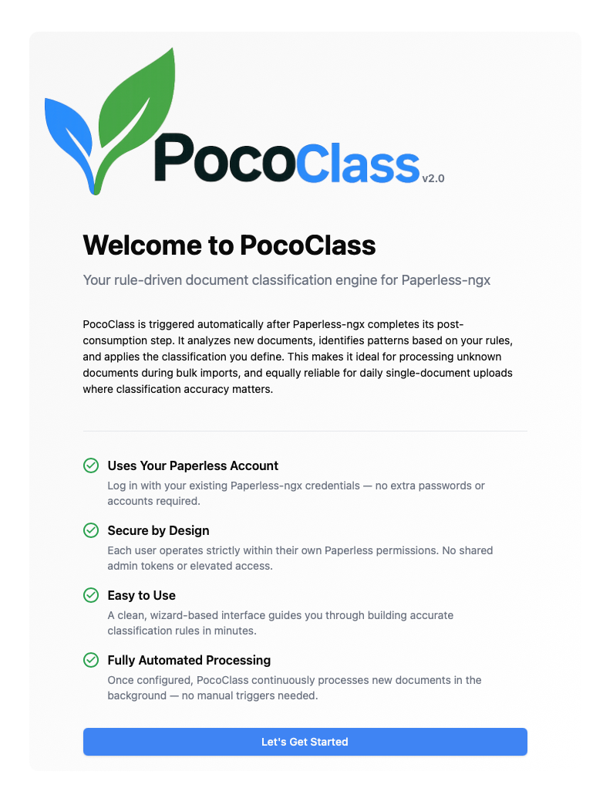

# PocoClass

PocoClass is a companion application for [Paperless-ngx](https://github.com/paperless-ngx/paperless-ngx) that automates document classification with a focus on control and transparency.

<br>

### The Problem: Learning Has Limits

Paperless-ngx is an excellent tool for document indexing. While its built-in classifier uses OCR and statistical learning to suggest metadata, this approach has inherent limitations:

- **Training Requirements:** The classifier requires a large volume of manually classified documents before it becomes reliable.
- **Contextual Confusion:** Subtle nuances often lead to misclassification. For instance, a classifier might select the wrong date from a document containing multiple timestamps or confuse two similar documents from the same organization (e.g., an account summary versus a contract update).
- **Format Shifts:** Annual formatting changes or minor variations between subsidiaries can easily disrupt pattern-based recognition.

As archives grow into the thousands, manual corrections become a repetitive burden. When users stop correcting these small errors, metadata becomes inconsistent and the quality of the digital archive degrades.

<br>

### The Solution: Deterministic Rule-Based Logic

PocoClass addresses these gaps by introducing deterministic, rule-based classification. Rather than relying on learned behaviors, it uses explicit identification logic — including flexible pattern matching and dynamic data extraction — to classify documents with high precision.

- **Step-by-Step Wizard:** Create complex rules without writing code.
- **Background Processing:** Automatically monitors for new or unclassified documents.
- **Transparent Scoring:** When a document matches a rule, PocoClass provides clear reasoning for the match.
- **Direct Integration:** Applied classifications are pushed directly to your Paperless-ngx instance.

When a document matches, it matches for a defined reason.

<br>

### Origin Story: Why “POCO”?

The name stands for Post Consumption.

The project originated as a small script triggered by the Paperless-ngx post-consumption hook, a mechanism that runs immediately after a document is imported. It began as a simple tool designed to support bulk imports and gradually evolved into a structured YAML-based rule engine.

PocoClass v2.0 emerged from what initially started as an experiment to build a web-based frontend using Replit. What was meant to be a lightweight interface quickly turned into a complete redesign. The result was a fully reimagined application with a visual rule builder, background processing, and a transparent scoring system.

<br>

| <div align="center"><b>Welcome Screen</b></div> | <div align="center"><b>Defining OCR Patterns</b></div> |
|---|---|
| <div align="center"><a href="documentation/images/Welcome_Screen.png"></a></div> | <div align="center"><a href="documentation/images/rule_wizard.png"></a></div> |

| <div align="center"><b>OCR Identification</b></div> | <div align="center"><b>Rule Evaluation</b></div> |
|---|---|
| <div align="center"><a href="documentation/images/ocr_identification.png"></a></div> | <div align="center"><a href="documentation/images/rule_evaluation.png"></a></div> |

<br>

## Architecture

```
┌─────────────────────────────────┐
│         React Frontend          │
│  Rule Wizard · Dashboard · Logs │
└──────────────┬──────────────────┘
               │ REST API
┌──────────────▼──────────────────┐
│         Flask Backend           │
│  POCO Engine · Pattern Matcher  │
│  Metadata Extractor · Scheduler │
└──────────────┬──────────────────┘
               │
┌──────────────▼──────────────────┐
│     Paperless-ngx Instance      │
│          (REST API)             │
└─────────────────────────────────┘
```

**Frontend:** React, Vite, Tailwind CSS
**Docker base:** `11notes/python:3.13` (rootless Alpine)

<br>

### Backend

- **Flask REST API** — rule management, document processing, authentication, settings
- **POCO Scoring v2 engine** — dual-score calculation with configurable weights and thresholds
- **Pattern matcher** — OCR content and filename regex matching with logic groups
- **Metadata extractor** — anchor-based extraction of dates, amounts, and custom fields
- **Background processor** — debounced, tag-based document discovery and automatic rule application
- **Rule loader** — YAML-based rule storage with validation
- **SQLite** — users, sessions, Paperless-ngx data cache, logs, processing history

<br>

## Installation

### Docker deployment (end-user)

This deployment path is for end users running PocoClass next to an existing Paperless-ngx setup.
It assumes you will run a prebuilt image and not build locally from source.

#### Overview

1. Create a deployment folder.
2. Copy the env template and choose bridge or host compose.
3. Configure `.env` (secret key, image, Paperless URL).
4. Configure shared Docker network settings (bridge mode only).
5. Start PocoClass and verify health.
6. Optionally enable post-consume trigger integration.

#### Step 1. Create deployment folder

```bash
mkdir -p ~/pococlass
cd ~/pococlass
git clone https://github.com/BrainPonders/PocoClass.git source
```

#### Step 2. Copy runtime templates and create required folders

```bash
cd ~/pococlass
cp source/docker/compose/env.example .env

# Bridge mode (recommended default)
cp source/docker/compose/docker-compose.bridge.yml docker-compose.yml

# Host mode (alternative)
# cp source/docker/compose/docker-compose.host.yml docker-compose.yml

cp source/scripts/post-consumption/pococlass_trigger.sh .
chmod +x pococlass_trigger.sh
mkdir -p rules data
```

Bridge vs host mode:

- Bridge mode: set `PAPERLESS_URL` to Docker-internal hostname (e.g. `http://paperless-webserver:8000`).
- Host mode: set `PAPERLESS_URL` to the same URL you use in your browser UI (e.g. `https://paperless.example.com`).

`rules/` stores your YAML rule files.  
`data/` stores runtime state.

Set permissions for your environment.
For 11notes-based setups, default container user is often `UID:GID 1000:1000`:

```bash
cd ~/pococlass
chown -R 1000:1000 rules data
chmod -R u+rwX,go-rwx rules data
```

#### Step 3. Configure `.env`

```bash
cd ~/pococlass
nano .env
```

Set:

- `POCOCLASS_SECRET_KEY` (required runtime secret), generate with:
```bash
python3 -c "import os, base64; print(base64.urlsafe_b64encode(os.urandom(32)).decode())"
```
or:
```bash
python3 source/scripts/generate_secret_key.py
```
- `POCOCLASS_IMAGE` (required image reference for deployment), for example:
  - `ghcr.io/<your-org>/pococlass:v2.0.0`
- `PAPERLESS_URL` (depends on selected compose mode)

Common `PAPERLESS_URL` values:

- Bridge mode (Docker-internal):
  - Official paperless-ngx compose: `http://paperless-webserver:8000`
  - 11notes paperless-ngx: `http://paperless-ngx:8000`
- Host mode (same as browser UI):
  - Example: `https://paperless.example.com`

`POCOCLASS_SECRET_KEY` is runtime-only and is not used during image build.

#### Step 4. Configure shared Docker network (bridge mode only)

If you selected `docker-compose.host.yml`, skip this step.

PocoClass must join the same Docker network as Paperless.

Check your Paperless network:

```bash
docker inspect paperless-webserver --format '{{range $k, $v := .NetworkSettings.Networks}}{{println $k}}{{end}}'
```

For 11notes setups:

```bash
docker inspect paperless-ngx --format '{{range $k, $v := .NetworkSettings.Networks}}{{println $k}}{{end}}'
```

Set in `.env`:

- `PAPERLESS_NETWORK_NAME=<network_name_from_inspect>`
- `PAPERLESS_NETWORK_EXTERNAL=true`

#### Step 5. Start and verify

```bash
cd ~/pococlass
docker compose pull
docker compose up -d
docker compose ps
docker compose logs -f pococlass
```

Health check:

```bash
curl -s http://localhost:5000/api/health
```

#### Step 6. Optional post-consume trigger

`pococlass_trigger.sh` is staged in `~/pococlass` from `source/scripts/post-consumption/pococlass_trigger.sh`.
Final destination should be your Paperless post-consume scripts folder.

```bash
cd ~/pococlass
cp pococlass_trigger.sh /path/to/paperless/scripts/
nano /path/to/paperless/scripts/pococlass_trigger.sh
chmod +x /path/to/paperless/scripts/pococlass_trigger.sh
```

Set `POCOCLASS_URL` and `POCOCLASS_TOKEN` in the trigger script.

### Updating deployment

Update `POCOCLASS_IMAGE` in `.env` to the target release tag, then:

```bash
cd ~/pococlass
docker compose pull pococlass
docker compose up -d --force-recreate pococlass
```

<br>

## Configuration

| Variable | Description | Default |
|----------|-------------|---------|
| `POCOCLASS_SECRET_KEY` | Encryption key for sessions (required) | — |
| `POCOCLASS_IMAGE` | Image reference to run (supports release/testing tags) | `pococlass:latest` |
| `PAPERLESS_URL` | Paperless-ngx URL (required for Docker, or configure in web UI) | — |
| `PAPERLESS_NETWORK_NAME` | Docker network shared with Paperless (bridge mode only) | `paperless_default` |
| `PAPERLESS_NETWORK_EXTERNAL` | Whether Paperless network already exists (bridge mode only) | `true` |
| `GUNICORN_WORKERS` | Number of worker processes | `3` |
| `GUNICORN_THREADS` | Threads per worker | `2` |
| `GUNICORN_TIMEOUT` | Request timeout (seconds) | `120` |

<br>

## First-time setup

1. Open PocoClass in your browser
2. Log in with your Paperless-ngx admin credentials
3. Complete the setup wizard — it connects to Paperless-ngx and creates the required custom fields and tags
4. Start building rules with the 6-step wizard or follow the built-in guided tutorial

<br>

## Features

- **Easy-to-use rule builder** — step-by-step wizard to create classification rules, no coding required
- **Set it and forget it** — create a rule once and let it run automatically in the background
- **Flexible scoring** — combines OCR content, filename patterns, and Paperless-ngx metadata for accurate classification
- **Bulk import friendly** — ideal for importing large batches of unknown documents into Paperless-ngx
- **Train Paperless faster** — helps automate the way Paperless learns to classify your documents
- **Multi-language UI** — English, German, Spanish, French, Italian, Dutch

<br>

## Roadmap

The roadmap is grouped into **New Features** and **Improvements** to clearly separate functional expansion from quality enhancements.

---
<br>

## New Features

**YAML Rule Import**  Import rules directly from YAML files to enable:
- Share rule configurations
- Onboard pre-built classification templates
- Reuse existing rule sets without recreating them in the wizard

<br>

**Rule Evaluation Reporting** Provide a full scoring breakdown, including:
- Earned vs. possible weights
- Source-level contribution (OCR, Filename, Paperless)
- Multiplier and threshold transparency

Goal: make the POCO score fully explainable.

<br>

**Rule Evaluation in File List** Display evaluation results directly in the document list view:
- Pass / Fail indicator
- POCO score preview
- Quick visibility without expanding detailed views

<br>

**Tutorials:**
Rule Evaluation Step-by-step guided walkthrough
Background Processing Step-by-step guided walkthrough

<br>

## Improvements

**GUI Standardisation and improvements**
- Consistent spacing
- Unified input sizing
- Standardised button styles
- Predictable layout patterns across pages
- Optimizing space to allow lower res views

---
<br>


## License

See [LICENSE](LICENSE) file for details.
