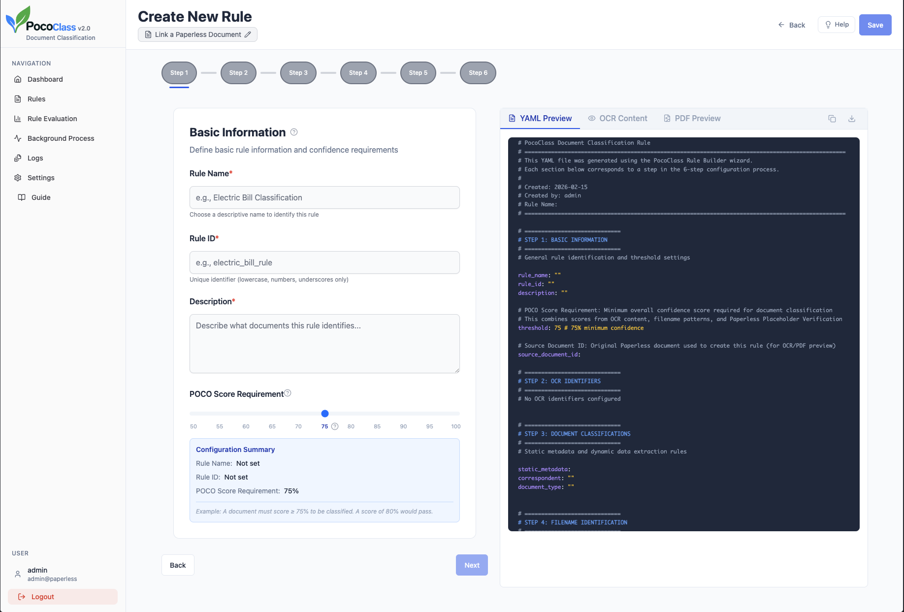
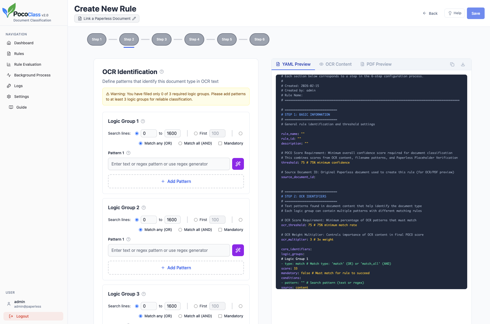
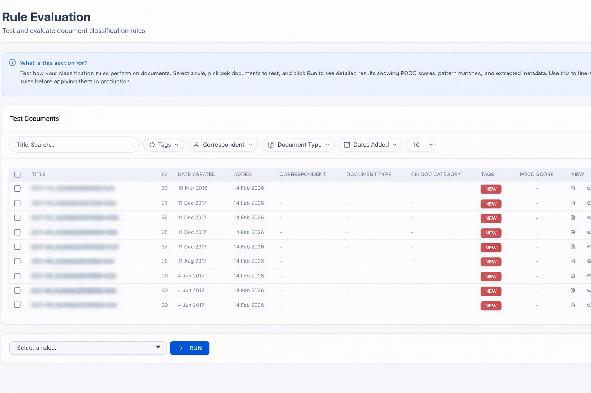

<p>
  
</p>
<p><em>Rule-based document classification for Paperless-ngx.</em></p>


<br>

# PocoClass

PocoClass is a companion application for [Paperless-ngx](https://github.com/paperless-ngx/paperless-ngx) that automates document classification with strict rule-based logic. Instead of relying purely on statistical learning, PocoClass applies explicit identification rules and pattern matching that you define, allowing documents to be classified with predictable results while maintaining full control and transparency over the process.

<br>

### Why use PocoClass?

Paperless-ngx is an excellent tool for document indexing. While its built-in classifier uses OCR and statistical learning to suggest metadata, this approach has inherent limitations:

- **Training Requirements:** The classifier requires a large volume of manually classified documents before it becomes reliable.
- **Contextual Confusion:** Subtle nuances often lead to misclassification. For instance, a classifier might select the wrong date from a document containing multiple timestamps or confuse two similar documents from the same organization (e.g., an account summary versus a contract update).
- **Format Shifts:** Annual formatting changes or minor variations between subsidiaries can easily disrupt pattern-based recognition.

When automated classification is not consistent, the Paperless database can quickly become ambiguous.

<br>

### How does PocoClass fit in here?

PocoClass addresses these gaps by providing rule-based classification. Rather than relying on learned behaviors, it uses explicit identification logic with flexible pattern matching and dynamic data extraction to classify documents with reliable precision.

- **Step-by-Step Rule Wizard:** First you create a rule for your document without writing code.
- **Rule Evaluation:** Test rules with dry runs and review results before modifying your database.
- **Transparent Scoring:** When a document matches a rule, PocoClass provides clear reasoning for the match.
- **Background Processing:** When you are happy with the results, it can run in the background to process unclassified documents.
- **Direct Integration:** Applied classifications are pushed directly to your Paperless-ngx instance.

When a document matches a rule, it does so for the reason you defined.

<br>

### What's in the name “POCO”?

The name stands for Post Consumption.

This project originated as a small script triggered by the built-in Paperless-ngx post-consumption hook, immediately after a document is imported. It began as a simple hardcoded tool designed purely for bulk imports. Over time it evolved into a structured YAML-based rule engine.

PocoClass v2.0 emerged from what initially started as an experiment to build a web-based frontend using Replit. What was meant to be a lightweight interface quickly turned into a complete redesign. The result is a fully reimagined application with a visual rule builder, background processing, and a transparent scoring system.

<br>
<p align="center">
  <a href="documentation/images/rule_wizard.png">
    
  </a>
  &nbsp;&nbsp;
  <a href="documentation/images/ocr_identification.png">
    
  </a>
  &nbsp;&nbsp;
  <a href="documentation/images/rule_evaluation.png">
    
  </a>
</p>

<br>

## Architecture

PocoClass consists of a lightweight web interface and a Python backend that integrates directly with the Paperless-ngx API.

```text
┌─────────────────────────────────┐
│         React Frontend          │
│  Rule Wizard · Dashboard · Logs │
└──────────────┬──────────────────┘
               │ REST API
┌──────────────▼──────────────────┐
│         Flask Backend           │
│  POCO Engine · Pattern Matcher  │
│  Metadata Extractor · Scheduler │
└──────────────┬──────────────────┘
               │
┌──────────────▼──────────────────┐
│     Paperless-ngx Instance      │
│          (REST API)             │
└─────────────────────────────────┘
```

**Technology Stack**

```text
Backend:
├── Flask (REST API framework)
├── Python 3.x
├── SQLite (embedded database)
├── Cryptography (token encryption)
└── PyYAML (rule configuration)

Frontend:
├── React 18+
├── Vite (build tool)
├── TailwindCSS (styling)
└── Shadcn/UI (component library)

Integration:
├── Paperless-ngx REST API
└── 11notes/python:3.13 (rootless Alpine base image)
```

----

<!-- BEGIN: AVAILABLE_VERSIONS -->
## Available Versions

This section is updated automatically from published release tags.
`latest` is intentionally not used.

| Channel | Current tag | Deployment value |
| --- | --- | --- |
| Stable | - | - |
| Release Candidate | `v2.0.0-rc.1` | `POCOCLASS_IMAGE=ghcr.io/brainponders/pococlass:v2.0.0` |
| Development | - | - |
<!-- END: AVAILABLE_VERSIONS -->
---

## Installation

This installation guide describes how to deploy PocoClass. The PocoClass Docker image is built on the [11notes Python](https://github.com/11notes/docker-python) image. 11notes images are container images designed around a more security-focused default setup. The container runs with `UID/GID 1000:1000` by default. To change this, please consult 11notes [RTFM](https://github.com/11notes/RTFM).

This installation guide supports two Paperless variants:
- **[Official paperless-ngx Docker Compose](https://github.com/paperless-ngx/paperless-ngx)**
- **[11notes paperless-ngx](https://github.com/11notes/docker-paperless-ngx)**

The instructions below assume that Paperless-ngx is already running and that PocoClass will connect in bridge mode to the same Docker network as Paperless-ngx.

This is the recommended setup because it keeps traffic between PocoClass and Paperless on the internal Docker network. That makes the connection simpler and more reliable: no reverse proxy is required between the two containers, no public hostname is needed, and there are no container-side TLS or certificate questions to solve.

The deployment uses one shared `docker-compose.yml` for both supported Paperless variants. The `.env` keeps the official Paperless values active by default and includes the 11notes values as commented presets.

The main difference between the two Paperless variants is usually naming. The Paperless container/service name and the Docker network name are different between the official stack and the 11notes stack, which is why both presets are included below.

Placing PocoClass behind a reverse proxy such as Caddy is recommended, but this is outside the scope of this guide.

---

#### 1. Create deployment folder

```bash
mkdir -p ~/pococlass
cd ~/pococlass
mkdir -p rules data
```

Set permissions:

```bash
chown -R 1000:1000 rules data
chmod -R u+rwX,go-rwx rules data
```
---

#### 2. Create `docker-compose.yml`

Create `~/pococlass/docker-compose.yml` with:

```yaml
services:
  pococlass:
    image: ${POCOCLASS_IMAGE}
    container_name: pococlass
    restart: unless-stopped

    ports:
      - "5000:5000"

    env_file:
      - .env

    volumes:
      - ./data:/app/data
      - ./rules:/app/rules

    healthcheck:
      test: ["CMD-SHELL", "python3 -c \"import urllib.request; urllib.request.urlopen('http://localhost:5000/api/health', timeout=5)\" || exit 1"]
      interval: 30s
      timeout: 10s
      retries: 5
      start_period: 20s

    networks:
      - paperless

networks:
  paperless:
    name: ${PAPERLESS_NETWORK_NAME:-paperless_default}
    external: true
```

---

#### 3. Edit `.env`

Generate a secret key:

```bash
python3 -c "import os, base64; print(base64.urlsafe_b64encode(os.urandom(32)).decode())"
```

Then edit `~/pococlass/.env` and set at least the following values.

> [!WARNING]
> For `POCOCLASS_IMAGE`, always use the exact tag from the `Available Versions` table above.

```env
POCOCLASS_SECRET_KEY=PASTE_GENERATED_KEY_HERE
POCOCLASS_IMAGE=ghcr.io/brainponders/pococlass:v2.0.0

# ----------------------------------------------------------------------------------------
# Below are the default configurations for both the Official Paperless-ngx image and
# the 11notes Paperless-ngx image. Comment out which one is not applicable for your setup.
# Using the Docker-internal network avoids DNS and TLS certificate trust setup.
# ----------------------------------------------------------------------------------------

# Official Paperless defaults
PAPERLESS_URL=http://webserver:8000
PAPERLESS_NETWORK_NAME=paperless_default

# 11notes Paperless defaults
# PAPERLESS_URL=http://paperless-ngx:8000
# PAPERLESS_NETWORK_NAME=dms_frontend

# These values assume default upstream setups and may differ in your installation.
```

`PAPERLESS_URL` is the URL PocoClass uses internally to call the Paperless REST API. In this recommended setup it should be the Docker-internal hostname of the Paperless container, not the URL you use in your browser.


An external URL such as `https://paperless.example.com` can also work, but that is not the recommended first setup because it depends on extra DNS, routing, and possibly TLS/certificate trust inside the container.

---

#### 4. Start PocoClass

```bash
cd ~/pococlass
```

```bash
docker compose up -d
docker compose logs -f pococlass
```

Health check:

```bash
curl http://localhost:5000/api/health
```

You should receive:

```json
{"status":"healthy", "database":"ok", "version":"2.0"}
```

Open in browser:

```
http://localhost:5000
```

---

#### Environment Variables

| Variable | Description | Example |
|----------|-------------|---------|
| `POCOCLASS_SECRET_KEY` | Required runtime encryption key | `base64_generated_string` |
| `PAPERLESS_URL` | Docker-internal Paperless URL | `http://webserver:8000` |
| `PAPERLESS_NETWORK_NAME` | Docker network shared with Paperless | `paperless_default` |
| `POCOCLASS_IMAGE` | Optional image override | `ghcr.io/brainponders/pococlass:v2.0.0` |

---

#### Optional: Post-Consumption Trigger

PocoClass can be triggered after each document import using the Paperless post-consume hook to start applying rule-based classification to new documents.

1. Copy the trigger script:

```bash
cp scripts/post-consumption/pococlass_trigger.sh /path/to/paperless/scripts/
chmod +x /path/to/paperless/scripts/pococlass_trigger.sh
```

2. Edit the script and set:

- `POCOCLASS_URL`
- `POCOCLASS_TOKEN`

3. Follow the official Paperless-ngx documentation to enable `PAPERLESS_POST_CONSUME_SCRIPT`.

Once enabled, PocoClass will automatically process new documents after import.

---

### First-time setup

1. Open PocoClass in your browser.
2. On the login screen, enter the same Paperless URL that you configured as `PAPERLESS_URL`.
   Example: `http://webserver:8000`, `http://paperless-ngx:8000`, or `https://paperless.mydomain.com`
3. Log in using your Paperless-ngx admin credentials.
4. Complete the setup wizard. It connects to Paperless-ngx and creates the required custom fields and tags.
5. Start building rules with the 6-step wizard or follow the built-in guided tutorial.

---

### Main Features

- **Easy-to-use rule builder** — step-by-step wizard to create classification rules, no coding required
- **Set it and forget it** — create a rule once and let it run automatically in the background
- **Flexible scoring** — combines OCR content, filename patterns, and Paperless-ngx metadata for accurate classification
- **Bulk import friendly** — ideal for importing large batches of unknown documents into Paperless-ngx
- **Train Paperless faster** — automatically applies correct classifications, helping Paperless learn without manual work
- **Multi-language UI** — English, German, Spanish, French, Italian, Dutch

---

### Roadmap

This roadmap combines planned work with major improvements that are already in place.
Items marked with `✅` are completed.

**Rule Authoring And Review**

- ✅ YAML preview during rule creation
- ✅ YAML export for finished rules
- ✅ Dedicated rule evaluation and review workspace
- Rule import from YAML files
- Rule evaluation results directly in the document list
- POCO score preview directly in document lists

**Onboarding And Guidance**

- ✅ First-run setup wizard
- ✅ Guided rule-building tutorial
- ✅ Validation banners for missing Paperless fields and tags
- Validate and complete documentation
- Step-by-step tutorial for rule evaluation
- Step-by-step tutorial for background processing

**Automation And Operations**

- ✅ Background processing control page
- ✅ Processing history and operational logs
- ✅ Post-consumption trigger integration for automatic processing
- Improved deployment guidance for reverse proxies and production hardening

**Interface Consistency And Usability**

- ✅ Multi-language UI
- Consistent spacing across all pages
- Unified input sizing and form rhythm
- Standardized button styles and actions
- More predictable page layout patterns
- Better space usage for lower-resolution screens

---
### Disclaimer

This software comes without any warranty. Use it at your own risk. It has the potential to corrupt your valuable Paperless-ngx database, so use the dry run wisely.

As mentioned, this software has been completely (re)written using the vibe-coding tool Replit. The original POCO scripts and a design document form the foundation of POCO v2.0 and define the core design and rule logic. AI was primarily used to accelerate implementation, particularly for the web frontend. However, I was not able to keep up with the thousands of lines of code that were changing continuously during development.

I have audited the final version three times with CodeX, which was actually quite entertaining. But yes… yet another AI agent.

---
### License

See [LICENSE](LICENSE) file for details.
