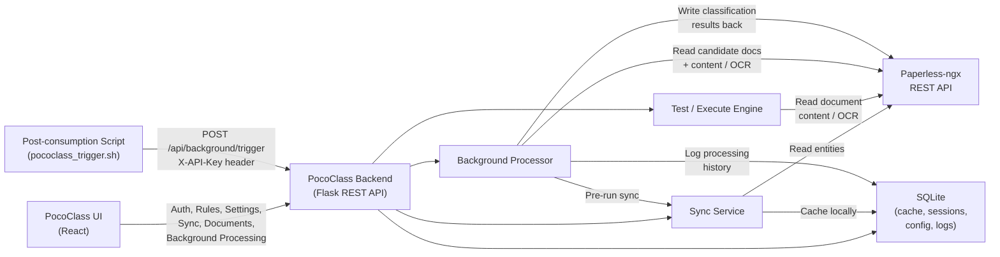

# PocoClass Architecture reference v2
**Version:** 2.0  
**Last Updated:** February 18, 2026  
**Purpose:** Comprehensive technical documentation for PocoClass v2 architecture, logic, and implementation

---

## Recent Changes

**February 18, 2026:**
- Updated architecture reference: corrected trigger types (`trigger`, `manual_run`, `manual_dry_run`, `automatic`), POCO scoring formula (paperless_max_weight = 0 when no verification fields), auto-pause bypass documentation, and background processing page path

**November 21, 2025:**
- Updated in-app guides (Full Guide + Quick Reference) with comprehensive documentation covering all aspects of PocoClass
- Removed personal data references (organization names) from documentation and examples for privacy compliance
- Updated UI documentation to reflect 1px border standardization across application

**November 20, 2025:**
- **Bug Fix**: Fixed critical custom field sync issue where deleted Paperless custom fields were persisting in PocoClass cache
  - Root cause: `sync_custom_field_placeholders()` in `database.py` only added new fields, never removed deleted ones
  - Solution: Added deletion logic to remove orphaned cache entries when fields are deleted from Paperless
  - Impact: Ensures PocoClass cache stays synchronized with Paperless configuration changes

---

## Table of Contents
1. [System Architecture](#1-system-architecture)
2. [Core Principles](#2-core-principles)
3. [POCO Scoring v2 Mechanism](#3-poco-scoring-v2-mechanism)
4. [Pattern Matching Engine](#4-pattern-matching-engine)
5. [Metadata Extraction System](#5-metadata-extraction-system)
6. [Rule Evaluation Process](#6-rule-evaluation-process)
7. [Background Processing System](#7-background-processing-system)
8. [User Control Mechanisms](#8-user-control-mechanisms)
9. [Data Flow Diagrams](#9-data-flow-diagrams)
10. [API Reference](#10-api-reference)
11. [Database Schema](#11-database-schema)
12. [Connectivity & Integration](#12-connectivity--integration)

---

## 1. System Architecture

### 1.1 Overview

PocoClass is an automated document classification system for Paperless-ngx that uses intelligent pattern matching, metadata extraction, and a dual-score evaluation mechanism to classify documents based on OCR content, filename patterns, and existing Paperless metadata.

**Key Components:**
- **Backend**: Python Flask REST API
- **Frontend**: React SPA with modern UI components
- **Database**: SQLite for configuration, sessions, and entity caching
- **Integration**: Paperless-ngx via REST API
- **Processing**: Background processor with debouncing and auto-pause

### 1.2 Technology Stack

```
Backend:
├── Flask (REST API framework)
├── Python 3.x
├── SQLite (embedded database)
├── Cryptography (token encryption)
└── PyYAML (rule configuration)

Frontend:
├── React 18+
├── Vite (build tool)
├── TailwindCSS (styling)
└── Shadcn/UI (component library)

Integration:
└── Paperless-ngx REST API
```

### 1.3 V2-Only Approach

PocoClass v2 has been **completely refactored** to remove all legacy v1 code. The system now operates exclusively with v2 logic:

**V2 Features:**
- **Logic Groups**: OCR patterns organized in AND/OR logic groups
- **Anchor-Based Extraction**: Dynamic metadata using beforeAnchor/afterAnchor patterns
- **Dual-Score System**: Transparent POCO OCR Score + actionable POCO Score
- **Regex Normalization**: JavaScript-style patterns (`/pattern/flags`) auto-converted to Python
- **Trust-Based Multipliers**: OCR (3x), Filename (1x), Paperless (neutralized)
- **Tag-Based Processing**: Discovery via NEW tag, classification via POCO+ / POCO- tags

**Removed V1 Legacy:**
- ❌ Old pattern_count and match_count logic
- ❌ Legacy score calculation formulas
- ❌ V1 metadata extraction methods
- ❌ Single-score evaluation
- ❌ Hybrid v1/v2 detection code

---

## 2. Core Principles

### 2.1 OCR as Source of Truth

**Philosophy**: Pattern matching against OCR content is the primary classification mechanism.

- OCR patterns receive **3x trust multiplier** (highest weight)
- OCR threshold (default 75%) acts as a **gate** - must pass before final classification
- Filename and Paperless verification are **supporting data sources**, not primary classifiers

### 2.2 Dual-Score Evaluation System

PocoClass calculates **TWO** scores for every document:

#### POCO OCR Score (Transparency Score)
- **Purpose**: Shows how well OCR content matched the rule patterns
- **Range**: 0-100%
- **Default Threshold**: 75%
- **Always Calculated**: Yes
- **Written to Custom Field**: Optional (user configurable)

#### POCO Score (Actionable Score)
- **Purpose**: Final classification score combining OCR, filename, and Paperless verification
- **Range**: 0-100%
- **Default Threshold**: 80% (configurable per rule)
- **Always Calculated**: Yes
- **Written to Custom Field**: Mandatory

### 2.3 Trust-Based Multipliers

Each data source has a **trust multiplier** reflecting its reliability:

| Source | Multiplier | Rationale |
|--------|------------|-----------|
| OCR Patterns | 3.0x | Most reliable - actual document content |
| Filename Patterns | 1.0x | Moderate reliability - user-controlled |
| Paperless Verification | 1/n | Neutralized - prevents field-count inflation |

### 2.4 Tag-Based Processing

**Always Tag, Always Score**: Every processed document receives:
1. **POCO Score** and **POCO OCR** custom fields (even if 0%)
2. **POCO+ tag** (if classified) or **POCO- tag** (if not classified)
3. **Scoring table** in document notes

**Tag-Based Discovery**:
- Documents marked with **NEW** tag are discovered for processing
- Documents with **POCO+** or **POCO-** tags are skipped (already processed)
- No gaps - once processed, permanently marked

### 2.5 No Gaps Philosophy

**Guarantee**: Every document that enters the processing pipeline gets scored and tagged, ensuring:
- No infinite re-processing loops
- Clear audit trail of classification attempts
- Transparent scoring even for non-matches

---

## 3. POCO Scoring v2 Mechanism

### 3.1 Algorithm Overview

The POCO Scoring v2 system implements a **weighted, multi-source evaluation** mechanism with two distinct scores.

```python
# Scoring Components
ocr_weighted = ocr_matches × 3.0          # OCR trust multiplier
filename_weighted = filename_matches × 1.0 # Filename trust multiplier
paperless_weighted = paperless_matches / paperless_total  # Neutralized (0 if no fields)

# POCO OCR Score (transparency)
poco_ocr_score = (ocr_weighted / ocr_max_weight) × 100

# POCO Score (actionable)
total_weighted = ocr_weighted + filename_weighted + paperless_weighted
paperless_max_weight = 1.0 if paperless_total > 0 else 0  # Excluded when no verification fields
total_max_weight = ocr_max_weight + filename_max_weight + paperless_max_weight
poco_score = (total_weighted / total_max_weight) × 100
```

### 3.2 Canonical Formula Reference

**This section documents the official POCO Scoring formulas using standard notation for transparency and auditability.**

#### Variable Notation

| Symbol | Meaning | Type |
|--------|---------|------|
| `m_ocr` | OCR identifiers (logic groups) matched | Integer |
| `t_ocr` | OCR identifiers (logic groups) defined | Integer (3-10) |
| `m_fn` | Filename patterns matched | Integer |
| `t_fn` | Filename patterns defined | Integer (1-5) |
| `m_md` | Metadata fields matching expected values | Integer |
| `t_md` | Metadata fields evaluated | Integer |
| `t_w` | Filename trust multiplier | Float (default: 1.0) |

#### Formula 1: OCR Weighted Score

```
OCR_weighted = (m_ocr / t_ocr) × t_ocr × 3
             = m_ocr × 3
```

**Displayed POCO OCR Score** (transparency):
```
POCO_OCR = (m_ocr / t_ocr) × 100
```

**Trust Multiplier**: `3` (fixed, very high reliability)

#### Formula 2: Filename Weighted Score

```
FN_weighted = (m_fn / t_fn) × t_fn × t_w
            = m_fn × t_w
```

**Trust Multiplier**: `t_w` (default: `1.0`, user-adjustable)

#### Formula 3: Metadata Weighted Score

```
MD_weighted = (m_md / t_md) × t_md × (1 / t_md)
            = m_md × (1 / t_md)
```

**Trust Multiplier**: `1 / t_md` (auto-calculated, neutralizes total weight)

**Maximum Weight**: `1.0` when verification fields exist, `0` when `t_md == 0` (no verification fields defined)

**Rationale**: Ensures metadata can contribute at most 1 point of weight, preventing field-count inflation. When no verification fields are defined, the Paperless component is excluded entirely from the denominator.

#### Formula 4: Final POCO Score

```
POCO = ((m_ocr × 3) + (m_fn × t_w) + (m_md × (1/t_md))) / ((t_ocr × 3) + (t_fn × t_w) + md_max) × 100
```

Where `md_max = 1` when `t_md > 0`, otherwise `md_max = 0`.

**Expanded**:

```
Numerator   = (m_ocr × 3) + (m_fn × t_w) + (m_md / t_md)   [paperless term = 0 when t_md = 0]
Denominator = (t_ocr × 3) + (t_fn × t_w) + md_max
POCO        = (Numerator / Denominator) × 100
```

#### Complete Example (Matching Summary Document)

**Input**:
- OCR: 8 out of 10 logic groups matched
- Filename: 2 out of 3 patterns matched  
- Metadata: 3 out of 5 fields verified
- Filename trust multiplier: 1.0

**Calculations**:

| Domain | Formula | Weighted | Max Weight |
|--------|---------|----------|------------|
| OCR | `8 × 3` | 24.0 | 30.0 |
| Filename | `2 × 1.0` | 2.0 | 3.0 |
| Metadata | `3 × (1/5)` | 0.6 | 1.0 |
| **Totals** | - | **26.6** | **34.0** |

**Results**:
```
POCO_OCR = (8 / 10) × 100 = 80.0%
POCO     = (26.6 / 34.0) × 100 = 78.24%
```

#### Design Principles

1. **Uniform Mathematics**: All domains use the same `(matched / total) × total × multiplier` pattern
2. **Scaling Fairness**: More identifiers = more influence (proportional weighting)
3. **Neutralized Metadata**: Paperless data can never dominate (max weight = 1)
4. **Transparency**: Both POCO OCR and POCO Final scores displayed
5. **Simplicity**: No damping factors, penalties, or hidden coefficients

### 3.3 Detailed Formula Breakdown

#### 3.3.1 OCR Component

**Input**:
- `ocr_matches`: Number of logic groups matched
- `ocr_total`: Total number of logic groups defined
- `ocr_multiplier`: 3.0 (default trust weight)

**Calculation**:
```python
ocr_weighted = ocr_matches × 3.0
ocr_max_weight = ocr_total × 3.0
poco_ocr_percentage = (ocr_weighted / ocr_max_weight) × 100
```

**Example**:
- 8 out of 10 logic groups matched
- `ocr_weighted = 8 × 3.0 = 24.0`
- `ocr_max_weight = 10 × 3.0 = 30.0`
- `poco_ocr_score = (24.0 / 30.0) × 100 = 80%`

#### 3.3.2 Filename Component

**Input**:
- `filename_matches`: Number of filename patterns matched
- `filename_total`: Total number of filename patterns defined
- `filename_multiplier`: 1.0 (default trust weight)

**Calculation**:
```python
filename_weighted = filename_matches × 1.0
filename_max_weight = filename_total × 1.0
filename_percentage = (filename_matches / filename_total) × 100
```

**Example**:
- 2 out of 3 filename patterns matched
- `filename_weighted = 2 × 1.0 = 2.0`
- `filename_max_weight = 3 × 1.0 = 3.0`
- `filename_percentage = 66.67%`

#### 3.3.3 Paperless Verification Component

**Input**:
- `paperless_matches`: Number of metadata fields verified
- `paperless_total`: Total number of verification fields evaluated
- `paperless_multiplier`: `1 / paperless_total` (auto-calculated, neutralized)

**Calculation**:
```python
paperless_multiplier = 1.0 / paperless_total  # Neutralization
paperless_weighted = paperless_matches × paperless_multiplier
paperless_max_weight = 1.0 if paperless_total > 0 else 0  # Excluded when no verification fields
paperless_percentage = (paperless_matches / paperless_total) × 100 if paperless_total > 0 else 0
```

**Example**:
- 3 out of 5 verification fields matched
- `paperless_multiplier = 1.0 / 5 = 0.2`
- `paperless_weighted = 3 × 0.2 = 0.6`
- `paperless_max_weight = 1.0` (fixed)
- `paperless_percentage = 60%`

**Why Neutralization?**  
Without neutralization, rules with more verification fields would artificially inflate scores. By setting `max_weight = 1.0`, verification contributes **at most 1 point** to the final score regardless of field count.

#### 3.3.4 Combined POCO Score

**Calculation**:
```python
total_weighted = ocr_weighted + filename_weighted + paperless_weighted
paperless_max_weight = 1.0 if paperless_total > 0 else 0
total_max_weight = ocr_max_weight + filename_max_weight + paperless_max_weight
poco_score = (total_weighted / total_max_weight) × 100
```

**Complete Example**:

```
OCR: 8/10 matched → weighted 24.0 / 30.0
Filename: 2/3 matched → weighted 2.0 / 3.0
Paperless: 3/5 verified → weighted 0.6 / 1.0

Total Weighted: 24.0 + 2.0 + 0.6 = 26.6
Total Max Weight: 30.0 + 3.0 + 1.0 = 34.0

POCO OCR Score = (24.0 / 30.0) × 100 = 80.0%
POCO Score = (26.6 / 34.0) × 100 = 78.24%
```

### 3.4 Threshold Evaluation

Classification requires **BOTH** thresholds to pass:

```python
ocr_passes = poco_ocr_score >= ocr_threshold  # Default: 75%
poco_passes = poco_score >= poco_threshold     # Default: 80%

classification_allowed = ocr_passes AND poco_passes
```

**Decision Matrix**:

| POCO OCR | POCO Score | Result | Rationale |
|----------|------------|--------|-----------|
| 80% | 85% | ✅ CLASSIFIED | Both pass |
| 70% | 85% | ❌ REJECTED | OCR below gate |
| 80% | 75% | ❌ REJECTED | POCO below threshold |
| 60% | 60% | ❌ REJECTED | Both fail |

**Critical Rule**: If `POCO_OCR < 75%`, rule fails immediately regardless of final POCO score.

#### Score Interpretation Guide

| Range | Meaning | Action |
|-------|---------|--------|
| 0-70% | Low confidence | Classification fails |
| 70-80% | Borderline | Filename/Metadata may tip the scale |
| 80-90% | Confident | Classification applied |
| > 90% | Strongly validated | High confidence match |
| 100% | Perfect alignment | All identifiers matched |

### 3.5 Status Categories

Based on combined scores, documents receive a **status**:

```python
if poco_score == 0:
    status = 'FAIL'
    reason = 'OCR failed mandatory identifiers'
elif poco_ocr_score < ocr_threshold:
    status = 'FAIL'
    reason = f'OCR score {poco_ocr_score}% below threshold {ocr_threshold}%'
elif poco_score < poco_threshold:
    status = 'BORDERLINE'
    reason = f'POCO score {poco_score}% below threshold {poco_threshold}%'
elif poco_score >= 90:
    status = 'EXCELLENT'
    reason = 'Very high confidence; all sources aligned'
elif poco_score >= 80:
    status = 'CONFIDENT'
    reason = 'Confident classification'
else:
    status = 'PASS'
    reason = 'Classification acceptable'
```

### 3.6 Implementation Reference

**File**: `scoring_calculator_v2.py`

**Key Methods**:
- `calculate_scores()`: Computes both POCO OCR and POCO scores
- `evaluate_thresholds()`: Determines classification_allowed status
- `calculate_full_evaluation()`: Complete scoring + threshold evaluation

> **Source**: `scoring_calculator_v2.py` — `POCOScoringV2.calculate_scores()` (line 35), `evaluate_thresholds()` (line 126), `calculate_full_evaluation()` (line 188)

---

## 4. Pattern Matching Engine

### 4.1 Logic Group Architecture

**Logic Groups** are the fundamental unit of OCR pattern matching in v2. Each group:
- Counts as **1 unit** for scoring (not individual patterns)
- Contains one or more **conditions** (patterns)
- Has a **type** (AND or OR logic)

**Group Types**:
1. **`match_all` (AND)**: ALL conditions must match
2. **`match` or `or` (OR)**: At least ONE condition must match

**Structure**:
```yaml
core_identifiers:
  logic_groups:
    - title: "Bank Identifier"
      type: "match_all"  # AND logic — every condition must match
      conditions:
        - pattern: "/Organization Name/i"
          source: "content"
        - pattern: "/Account.*Number/i"
          source: "content"
    
    - title: "Account Type"
      type: "match"  # OR logic — at least one condition must match
      conditions:
        - pattern: "/Checking Account/i"
          source: "content"
        - pattern: "/Savings Account/i"
          source: "content"
```

### 4.2 Regex Normalization

**Challenge**: Frontend wizard saves patterns in JavaScript format (`/pattern/flags`), but Python uses different regex syntax.

**Solution**: `normalize_regex_pattern()` auto-converts JavaScript patterns to Python.

**Conversion Logic**:
```python
def normalize_regex_pattern(pattern: str) -> Tuple[str, int]:
    # JavaScript format: /pattern/flags
    if pattern.startswith('/') and '/' in pattern[1:]:
        last_slash_idx = pattern.rfind('/')
        raw_pattern = pattern[1:last_slash_idx]
        flags_str = pattern[last_slash_idx + 1:]
        
        # Convert flags
        flags = 0
        if 'i' in flags_str:  # Case insensitive
            flags |= re.IGNORECASE
        if 'm' in flags_str:  # Multiline
            flags |= re.MULTILINE
        if 's' in flags_str:  # Dotall
            flags |= re.DOTALL
        
        return (raw_pattern, flags)
    
    # Plain pattern - default flags
    return (pattern, re.IGNORECASE | re.MULTILINE)
```

**Examples**:

| Input Pattern | Normalized Pattern | Flags |
|---------------|-------------------|-------|
| `/Organization/i` | `Organization` | `IGNORECASE \| MULTILINE` |
| `/Invoice\s+\d+/im` | `Invoice\s+\d+` | `IGNORECASE \| MULTILINE` |
| `Account Number` | `Account Number` | `IGNORECASE \| MULTILINE` (default) |

### 4.3 Pattern Matching with Source and Range

Each condition supports:
- **Source**: `content` (OCR text) or `filename`
- **Range**: Line-number based text slicing (e.g., "0-25" = lines 0 through 24 of the document)

**Range Filtering**:
```python
def check_pattern_match_detailed(self, pattern_str, condition, content, filename):
    source = condition.get('source', 'content')
    range_str = condition.get('range', '')
    
    text = content if source == 'content' else filename
    
    # Apply line-range filter when specified (only meaningful for content)
    if range_str and source == 'content' and '-' in range_str:
        try:
            parts = range_str.split('-')
            start_line = int(parts[0])
            end_line = int(parts[1])
            
            lines = text.splitlines()
            total_lines = len(lines)
            
            # Clamp to valid bounds to avoid index errors
            start_line = max(0, min(start_line, total_lines))
            end_line = max(0, min(end_line, total_lines))
            
            if start_line < end_line:
                selected_lines = lines[start_line:end_line]
                text = '\n'.join(selected_lines)
        except (ValueError, IndexError):
            pass  # Gracefully fall back to full text
    
    normalized_pattern, flags = self.normalize_regex_pattern(pattern_str)
    
    try:
        match = re.search(normalized_pattern, text, flags)
        if match:
            matched_text = match.group(0)
            if len(matched_text) > 50:
                matched_text = matched_text[:47] + '...'
            return {'matched': True, 'pattern': pattern_str, 'matched_text': matched_text}
        else:
            return {'matched': False, 'pattern': pattern_str, 'matched_text': None}
    except re.error as e:
        return {'matched': False, 'pattern': pattern_str, 'matched_text': None, 'error': str(e)}
```

**Use Case**: Bank statements often have account info in the first 25 lines of the document.

### 4.4 OCR Match Counting

**Algorithm**:
```python
def count_ocr_matches(self, logic_groups, content, filename):
    total_count = 0
    matched_count = 0
    all_matches = []
    
    for i, group in enumerate(logic_groups):
        group_type = group.get('type', 'match')
        conditions = group.get('conditions', [])
        score = group.get('score', 0)
        
        total_count += 1
        condition_results = []
        
        group_matched = False
        if group_type == 'match_all':  # AND logic — every condition must match
            all_match = True
            for condition in conditions:
                pattern_str = condition.get('pattern', '')
                match_result = self.check_pattern_match_detailed(pattern_str, condition, content, filename)
                condition_results.append(match_result)
                if not match_result['matched']:
                    all_match = False
            group_matched = all_match
        
        else:  # OR logic (type 'match' or 'or') — any single condition is sufficient
            for condition in conditions:
                pattern_str = condition.get('pattern', '')
                match_result = self.check_pattern_match_detailed(pattern_str, condition, content, filename)
                condition_results.append(match_result)
                if match_result['matched']:
                    group_matched = True
        
        group_name = group.get('title', f'Logic Group {i + 1}')
        
        if group_matched:
            matched_count += 1
            all_matches.append({
                'name': group_name,
                'matched': True,
                'score': score,
                'group_type': group_type,
                'conditions': condition_results
            })
        else:
            all_matches.append({
                'name': group_name,
                'matched': False,
                'score': 0,
                'group_type': group_type,
                'conditions': condition_results
            })
    
    return {
        'total_count': total_count,
        'matched_count': matched_count,
        'matches': all_matches
    }
```

### 4.5 Filename Pattern Matching

**Counting with Capture Group Extraction**:
```python
def count_filename_matches(self, filename_patterns, filename):
    if not filename_patterns:
        return {'total_count': 0, 'matched_count': 0, 'matches': []}
    
    total_count = len(filename_patterns)
    matched_count = 0
    matches = []
    
    for pattern in filename_patterns:
        try:
            normalized_pattern, flags = self.normalize_regex_pattern(pattern)
            match = re.search(normalized_pattern, filename, flags)
            if match:
                matched_count += 1
                extracted_value = match.group(1) if match.groups() else match.group(0)
                matches.append({
                    'pattern': pattern, 'matched': True,
                    'score': 1, 'extracted_value': extracted_value
                })
            else:
                matches.append({
                    'pattern': pattern, 'matched': False,
                    'score': 0, 'extracted_value': None
                })
        except re.error as e:
            matches.append({
                'pattern': pattern, 'matched': False,
                'score': 0, 'extracted_value': None
            })
    
    return {
        'total_count': total_count,
        'matched_count': matched_count,
        'matches': matches
    }
```

### 4.6 Implementation Reference

**File**: `pattern_matcher.py`

**Key Methods**:
- `evaluate_rule_v2()`: Main entry point for pattern matching
- `normalize_regex_pattern()`: JavaScript → Python regex conversion
- `count_ocr_matches()`: Logic group evaluation
- `count_filename_matches()`: Filename pattern evaluation with capture group extraction
- `check_pattern_match_detailed()`: Single pattern match with source/range support (returns detailed result)
- `check_pattern_match()`: Boolean-only convenience wrapper

> **Source**: `pattern_matcher.py` — `PatternMatcher.evaluate_rule_v2()` (line 33), `normalize_regex_pattern()` (line 76), `count_ocr_matches()` (line 111), `check_pattern_match_detailed()` (line 211), `count_filename_matches()` (line 297)

---

## 5. Metadata Extraction System

### 5.1 Extraction Types Overview

PocoClass v2 supports three types of metadata:

1. **Static Metadata**: Fixed values for all documents matching the rule
2. **Dynamic Metadata**: Extracted from document content using anchor patterns
3. **Filename Metadata**: Extracted from document filename using regex groups

### 5.2 Static Metadata

**Definition**: Metadata that is the same for all documents classified by a rule.

**Format**:
```yaml
static_metadata:
  correspondent: "Financial Institution"
  document_type: "Statement"
  tags:
    - "Financial"
    - "Banking"
  custom_fields:
    Account Type: "Checking"
    Institution: "Organization Name"
```

**Processing**:
```python
def extract_static_metadata(rule):
    static_metadata = rule.get('static_metadata', {})
    processed = {}
    
    for field, value in static_metadata.items():
        if field == 'custom_fields' and isinstance(value, dict):
            # Convert to Paperless API format
            processed[field] = [
                {'name': k, 'value': v} 
                for k, v in value.items()
            ]
        elif field == 'tags' and isinstance(value, list):
            processed[field] = value
        else:
            processed[field] = value
    
    return processed
```

### 5.3 Dynamic Metadata - Anchor-Based Extraction

**V2 Feature**: Extract values from document content using **beforeAnchor** and **afterAnchor** patterns.

**Extraction Modes**:

1. **Both Anchors**: Extract text between two patterns
   ```yaml
   field_name:
     beforeAnchor: "Invoice Date:"
     afterAnchor: "Due Date:"
     extraction_type: "date"
     format: "DD-MM-YYYY"
   ```

2. **After Anchor Only**: Extract text after pattern until newline
   ```yaml
   field_name:
     afterAnchor: "Total Amount:"
     extraction_type: "monetary"
   ```

3. **Before Anchor Only**: Extract text before pattern from line start
   ```yaml
   field_name:
     beforeAnchor: "EUR"
     extraction_type: "monetary"
   ```

**Anchor Pattern Matching** (sequential windowed approach):
```python
def extract_value_between_anchors(self, text, before_pattern, after_pattern):
    try:
        search_text = text
        
        if not before_pattern and not after_pattern:
            return None
        
        # Step 1: Find beforeAnchor, take text AFTER it
        if before_pattern:
            before_match = re.search(before_pattern, search_text, re.IGNORECASE | re.MULTILINE)
            if before_match:
                search_text = search_text[before_match.end():]
            else:
                return None
        
        # Step 2: Find afterAnchor in remaining text, take text BEFORE it
        if after_pattern:
            after_match = re.search(after_pattern, search_text, re.IGNORECASE | re.MULTILINE)
            if after_match:
                search_text = search_text[:after_match.start()]
            else:
                return None
        
        # Step 3: Return the window between the two anchors
        result = search_text.strip()
        return result if result else None
        
    except Exception as e:
        self.logger.error(f"Error extracting value between anchors: {e}")
        return None
```

### 5.4 Extraction Types

**V2 Enhancement**: The `extraction_type` field filters and formats extracted values.

#### 5.4.1 Date Extraction

**Supports UI-Friendly Formats**:
- `DD-MM-YYYY` → `\d{2}-\d{2}-\d{4}`
- `MM/DD/YYYY` → `\d{2}/\d{2}/\d{4}`
- `YYYY-MM-DD` → `\d{4}-\d{2}-\d{2}`
- `DD.MM.YYYY` → `\d{2}\.\d{2}\.\d{4}`

**Process**:
```python
def extract_date_from_text(text, date_format):
    # Convert UI format to regex pattern
    pattern = date_format
    pattern = pattern.replace('YYYY', r'\d{4}')
    pattern = pattern.replace('MM', r'\d{2}')
    pattern = pattern.replace('DD', r'\d{2}')
    
    match = re.search(pattern, text)
    if match:
        return match.group(0)
    return None

def parse_date_with_format(date_str, date_format):
    # Convert UI format to strptime format
    strptime_format = date_format
    strptime_format = strptime_format.replace('YYYY', '%Y')
    strptime_format = strptime_format.replace('MM', '%m')
    strptime_format = strptime_format.replace('DD', '%d')
    
    try:
        parsed_date = datetime.strptime(date_str, strptime_format)
        return parsed_date.strftime('%Y-%m-%d')  # ISO format for Paperless
    except ValueError:
        return None
```

**Example**:
```
Raw Text: "Invoice Date: 27-12-2024"
Format: "DD-MM-YYYY"

Step 1: Extract → "27-12-2024"
Step 2: Parse → date(2024, 12, 27)
Step 3: Convert → "2024-12-27" (ISO)
```

#### 5.4.2 Text Extraction

**Simple**: Return extracted value as-is after stripping whitespace.

```python
if extraction_type == 'text':
    return value.strip()
```

#### 5.4.3 Numeric Extraction (Integer, Float, Monetary)

**Sanitization** removes separators and currency symbols:

```python
def validate_and_sanitize_value(value, data_type):
    if data_type == 'integer':
        cleaned = re.sub(r'[,\s]', '', value)
        match = re.search(r'-?\d+', cleaned)
        return str(int(match.group())) if match else None
    
    elif data_type == 'float':
        cleaned = value.replace(',', '.')
        cleaned = re.sub(r'(?<=\d)\s(?=\d)', '', cleaned)
        match = re.search(r'-?\d+\.?\d*', cleaned)
        return str(float(match.group())) if match else None
    
    elif data_type == 'monetary':
        cleaned = value.replace(',', '.')
        cleaned = re.sub(r'[^\d.-]', '', cleaned)
        match = re.search(r'-?\d+\.?\d*', cleaned)
        if match:
            return f"{float(match.group()):.2f}"
        return None
```

**Example**:
```
Input: "€ 1.250,50"
Type: monetary

Step 1: Replace comma → "€ 1.250.50"
Step 2: Remove non-numeric → "1.250.50"
Step 3: Parse → 1250.50
Step 4: Format → "1250.50"
```

### 5.5 Filename Metadata Extraction

**V2 Feature**: Extract metadata from filename using **regex capture groups**.

**Configuration**:
```yaml
filename_patterns:
  - pattern: "Invoice_(\d{4})_(\d{2})_(.+)\.pdf"
    date_group: "1-2"  # Concatenate groups 1 and 2
    date_format: "%Y-%m"
    account_group: "3"

# Example filename: Invoice_2024_12_ACC12345.pdf
# Extracted: date_created = "2024-12", Account = "ACC12345"
```

**Extraction Logic**:
```python
def extract_filename_metadata(rule, filename):
    filename_patterns = rule.get('filename_patterns', [])
    extracted = {}
    
    for pattern_config in filename_patterns:
        if isinstance(pattern_config, dict):
            pattern = pattern_config['pattern']
            match = re.search(pattern, filename, re.IGNORECASE)
            
            if match:
                # Extract date if specified
                if 'date_group' in pattern_config:
                    date_group_config = pattern_config['date_group']
                    
                    if '-' in str(date_group_config):
                        # Group range: concatenate
                        start, end = map(int, str(date_group_config).split('-'))
                        date_str = ''.join(match.group(g) for g in range(start, end + 1))
                    else:
                        # Single group
                        date_str = match.group(int(date_group_config))
                    
                    # Parse date
                    date_format = pattern_config.get('date_format', '%Y-%m')
                    parsed_date = datetime.strptime(date_str, date_format)
                    extracted['date_created'] = parsed_date.strftime('%Y-%m-%d')
                
                # Extract account if specified
                if 'account_group' in pattern_config:
                    account_group = int(pattern_config['account_group'])
                    extracted['account'] = match.group(account_group)
                
                break  # Use first matching pattern
    
    return extracted
```

### 5.6 Implementation Reference

**File**: `metadata_processor.py`

**Key Methods**:
- `extract_metadata_from_rule()`: Main entry point
- `extract_static_metadata()`: Process static fields
- `extract_dynamic_metadata()`: Anchor-based extraction
- `extract_value_between_anchors()`: Sequential windowed anchor matching
- `apply_extraction_type_filter()`: Type-specific filtering
- `extract_filename_metadata()`: Filename regex group extraction
- `validate_and_sanitize_value()`: Numeric sanitization

> **Source**: `metadata_processor.py` — `MetadataProcessor.extract_metadata_from_rule()` (line 40), `extract_static_metadata()` (line 66), `extract_dynamic_metadata()` (line 93), `extract_value_between_anchors()` (line 144), `apply_extraction_type_filter()` (line 195), `extract_filename_metadata()` (line 404), `validate_and_sanitize_value()` (line 336)

---

## 6. Rule Evaluation Process

### 6.1 End-to-End Flow

**Complete Rule Test Execution**:

```
1. Input
   ├─ Rule (YAML config)
   ├─ Document Content (OCR text)
   ├─ Document Filename
   └─ Paperless Metadata (optional)

2. Pattern Matching (PatternMatcher)
   ├─ Evaluate OCR logic groups
   ├─ Evaluate filename patterns
   └─ Return match counts

3. Metadata Extraction (MetadataProcessor)
   ├─ Extract static metadata
   ├─ Extract dynamic metadata (content)
   └─ Extract filename metadata

4. Paperless Verification (TestEngine)
   ├─ Compare extracted vs. Paperless metadata
   └─ Return verification match counts

5. Score Calculation (POCOScoringV2)
   ├─ Calculate POCO OCR Score
   ├─ Calculate POCO Score
   └─ Evaluate thresholds

6. Build Response (TestEngine)
   ├─ Combine all results
   ├─ Format for frontend
   └─ Return JSON response
```

### 6.2 TestEngine Logic

**File**: `test_engine.py`

**Main Method**: `test_rule()`

```python
def test_rule(self, rule, document_content, document_filename, paperless_metadata=None):
    # 1. Pattern matching
    match_result = self.pattern_matcher.evaluate_rule_v2(
        rule, document_content, document_filename
    )
    
    # 2. Metadata extraction
    metadata = self.metadata_processor.extract_metadata_from_rule(
        rule, document_content, document_filename
    )
    
    # 3. Paperless verification
    verification_result = self.verify_paperless_metadata(
        rule, metadata, paperless_metadata
    ) if paperless_metadata else {'matched': 0, 'total': 0, 'matches': []}
    
    # 4. Score calculation
    ocr_threshold = rule.get('ocr_threshold', 75.0)
    poco_threshold = rule.get('threshold', 80.0)
    
    score_result = self.scorer.calculate_full_evaluation(
        ocr_matches=match_result['ocr']['matched'],
        ocr_total=match_result['ocr']['total'],
        filename_matches=match_result['filename']['matched'],
        filename_total=match_result['filename']['total'],
        paperless_matches=verification_result['matched'],
        paperless_total=verification_result['total'],
        ocr_multiplier=rule.get('ocr_multiplier', 3.0),
        filename_multiplier=rule.get('filename_multiplier', 1.0),
        ocr_threshold=ocr_threshold,
        poco_threshold=poco_threshold
    )
    
    # 5. Build comprehensive result
    return {
        'success': True,
        'rule_id': rule.get('rule_id'),
        'rule_name': rule.get('rule_name'),
        'classification_allowed': score_result['summary']['classification_allowed'],
        'status': score_result['evaluation']['status'],
        'threshold': poco_threshold,
        'ocr_threshold': ocr_threshold,
        'scores': {
            'poco_ocr_score': score_result['summary']['poco_ocr_score'],
            'poco_score': score_result['summary']['poco_score'],
            'ocr_threshold': ocr_threshold,
            'poco_threshold': poco_threshold
        },
        'breakdown': {
            'ocr': {
                'matched': match_result['ocr']['matched'],
                'total': match_result['ocr']['total'],
                'weighted': score_result['scores']['ocr']['weighted'],
                'max_weight': score_result['scores']['ocr']['max_weight'],
                'percentage': score_result['scores']['ocr']['percentage'],
                'matches': match_result['ocr']['matches'],
                'groups': match_result['ocr']['matches']  # Alias for frontend
            },
            'filename': {
                'matched': match_result['filename']['matched'],
                'total': match_result['filename']['total'],
                'weighted': score_result['scores']['filename']['weighted'],
                'max_weight': score_result['scores']['filename']['max_weight'],
                'percentage': score_result['scores']['filename']['percentage'],
                'matches': match_result['filename']['matches'],
                'patterns': match_result['filename']['matches']  # Alias for frontend
            },
            'paperless': {
                'matched': verification_result['matched'],
                'total': verification_result['total'],
                'weighted': score_result['scores']['paperless']['weighted'],
                'max_weight': score_result['scores']['paperless']['max_weight'],
                'percentage': score_result['scores']['paperless']['percentage'],
                'matches': verification_result['matches']
            },
            'verification': {
                'matched': verification_result['matched'],
                'total': verification_result['total'],
                'matches': verification_result['matches']  # Alias for frontend
            }
        },
        'extracted_metadata': {
            'static': metadata.get('static', {}),
            'dynamic': metadata.get('dynamic', {}),
            'filename': metadata.get('filename', {})
        },
        'evaluation': {
            'message': score_result['evaluation']['reason'],
            'ocr_passes': score_result['evaluation']['ocr_passes'],
            'poco_passes': score_result['evaluation']['poco_passes']
        }
    }
```

### 6.3 Frontend Transformation

**Response Structure for UI**:

```json
{
  "success": true,
  "rule_id": "rule_001",
  "rule_name": "Organization Statement",
  "classification_allowed": true,
  "status": "CONFIDENT",
  "threshold": 80.0,
  "ocr_threshold": 75.0,
  "scores": {
    "poco_ocr_score": 85.0,
    "poco_score": 82.5,
    "ocr_threshold": 75.0,
    "poco_threshold": 80.0
  },
  "breakdown": {
    "ocr": {
      "matched": 8,
      "total": 10,
      "weighted": 24.0,
      "max_weight": 30.0,
      "percentage": 80.0,
      "matches": [...],
      "groups": [...]
    },
    "filename": {
      "matched": 2,
      "total": 3,
      "weighted": 2.0,
      "max_weight": 3.0,
      "percentage": 66.67,
      "matches": [...],
      "patterns": [...]
    },
    "paperless": {
      "matched": 3,
      "total": 5,
      "weighted": 0.6,
      "max_weight": 1.0,
      "percentage": 60.0,
      "matches": [...]
    },
    "verification": {
      "matched": 3,
      "total": 5,
      "matches": [...]
    }
  },
  "extracted_metadata": {
    "static": {
      "correspondent": "Organization Name",
      "tags": ["Financial"]
    },
    "dynamic": {
      "date_created": "2024-12-27",
      "account_number": "123456789"
    },
    "filename": {}
  },
  "evaluation": {
    "message": "Confident classification",
    "ocr_passes": true,
    "poco_passes": true
  }
}
```

**Frontend Usage**:
- Display scores in **circular progress indicators**
- Show breakdown in **expandable sections**
- Highlight matched/unmatched patterns with **color coding**
- Display extracted metadata in **preview cards**

### 6.4 Verification Logic

**Paperless Metadata Verification**:

```python
def verify_paperless_metadata(self, rule, extracted_metadata, paperless_metadata):
    verification_fields = rule.get('verification_fields', [])
    if not verification_fields:
        return {'matched': 0, 'total': 0, 'matches': [], 'skipped': True}
    
    matched = 0
    matches = []
    
    all_extracted = {}
    all_extracted.update(extracted_metadata.get('static', {}))
    all_extracted.update(extracted_metadata.get('dynamic', {}))
    all_extracted.update(extracted_metadata.get('filename', {}))
    
    for field in verification_fields:
        extracted_value = self._resolve_field_value(field, all_extracted)
        paperless_value = self._resolve_field_value(field, paperless_metadata)
        
        # Only compare when both sides have a value
        if extracted_value is not None and paperless_value is not None:
            match_result = self._values_match(extracted_value, paperless_value)
            if match_result:
                matched += 1
                matches.append({
                    'field': field, 'extracted': extracted_value,
                    'paperless': paperless_value, 'match': True
                })
            else:
                matches.append({
                    'field': field, 'extracted': extracted_value,
                    'paperless': paperless_value, 'match': False
                })
    
    # Total reflects only the fields that were actually compared
    total = len(matches)
    
    return {'matched': matched, 'total': total, 'matches': matches}

def _values_match(self, extracted, paperless):
    # Handle tags (list comparison) — filter out 'NEW' inbox tag
    if isinstance(extracted, list) and isinstance(paperless, list):
        paperless_filtered = [tag for tag in paperless if tag.upper() != 'NEW']
        return set(extracted) == set(paperless_filtered)
    
    # Handle strings (case-insensitive)
    if isinstance(extracted, str) and isinstance(paperless, str):
        return extracted.lower().strip() == paperless.lower().strip()
    
    # Handle other types
    return str(extracted).strip() == str(paperless).strip()
```

> **Note**: `_resolve_field_value()` handles camelCase → snake_case mapping (e.g., `documentType` → `document_type`), Paperless nested objects (extracts `name` from `{"id": 1, "name": "Invoice"}`), and custom field lookups via Title Case conversion.

> **Source**: `test_engine.py` — `TestEngine.test_rule()` (line 39), `verify_paperless_metadata()` (line 164), `_resolve_field_value()` (line 235), `_values_match()` (line 316)

---

## 7. Background Processing System

### 7.1 Architecture Overview

**Trigger Mechanism**: PocoClass uses Paperless-ngx's **post-consumption script** feature to automatically process documents after they are consumed (imported) by Paperless.

**Components**:
1. **Post-Consumption Script**: A shell script calls the PocoClass API after Paperless consumes each document
2. **Debounced Trigger**: 30-second timer batches multiple rapid triggers into a single run
3. **Document Discovery**: Tag-based filtering finds documents with NEW tag (no POCO+/POCO-)
4. **Processing Lock**: Prevents concurrent processing runs
5. **Processing History**: Audit trail of all runs
6. **Rerun Flag**: Queues another run if triggered during processing

### 7.1.1 Paperless-ngx Post-Consumption Script Setup

To enable automatic processing, configure Paperless-ngx to call PocoClass after consuming documents.

A ready-to-use script is included at `scripts/post-consumption/pococlass_trigger.sh`. This script triggers PocoClass background processing when new documents are consumed.

**Note:** The NEW tag is assigned automatically by Paperless-ngx. When PocoClass creates the NEW tag, it configures it as an "inbox tag" (`is_inbox_tag=True`), which makes Paperless automatically assign it to all newly consumed documents.

**In Paperless-ngx configuration** (docker-compose.yml or environment):
```yaml
environment:
  - PAPERLESS_POST_CONSUME_SCRIPT=/path/to/pococlass_trigger.sh
```

**Configuration required** in `scripts/post-consumption/pococlass_trigger.sh`:
- `POCOCLASS_URL` - Your PocoClass server address
- `POCOCLASS_TOKEN` - PocoClass System API Token (generated in Settings → Background Processing)

**Make script executable**:
```bash
chmod +x /path/to/pococlass_trigger.sh
```

**Authentication**: The script uses the `X-API-Key` header with a permanent System API Token. This token:
- Is generated once and does not expire
- Is stored as SHA-256 hash in the database (cannot be retrieved after generation)
- Can be regenerated or revoked from Settings → Background Processing

See `ADMIN_GUIDE.md` for detailed setup instructions.

**Flow**:
```
1. Paperless consumes document → Paperless auto-assigns NEW tag (inbox tag feature)
2. Paperless runs post-consumption script
3. Script calls POST /api/background/trigger
4. PocoClass debouncer resets 30-second timer
5. (More documents trigger, timer keeps resetting...)
6. Timer expires → Processing batch starts
7. PocoClass discovers all NEW-tagged documents
8. Processes documents, applies POCO scoring
9. Updates documents, removes NEW tag, adds POCO+ or POCO- tag
```

**Benefits**:
- ✅ **Immediate Response**: Triggers right after document consumption
- ✅ **Efficient Batching**: Debouncer handles bulk imports gracefully (e.g., 100 documents → 1 batch)
- ✅ **No Polling**: Event-driven, minimal resource usage
- ✅ **Resilient**: Failed triggers don't block Paperless consumption

### 7.2 Tag-Based Discovery

**Discovery Query**:
```python
def _discover_documents(self, api_client):
    tag_new = self.db.get_config('bg_tag_new') or 'NEW'
    new_tag_id = api_client.get_tag_id(tag_new)
    poco_plus_tag_id = api_client.get_tag_id('POCO+')
    poco_minus_tag_id = api_client.get_tag_id('POCO-')
    
    if not new_tag_id:
        return []
    
    all_docs = api_client.get_documents(ignore_tags=True)
    
    filtered_docs = []
    for doc in all_docs:
        doc_tags = doc.get('tags', [])
        has_new = new_tag_id in doc_tags
        has_poco_plus = poco_plus_tag_id and poco_plus_tag_id in doc_tags
        has_poco_minus = poco_minus_tag_id and poco_minus_tag_id in doc_tags
        
        if has_new and not has_poco_plus and not has_poco_minus:
            filtered_docs.append(doc)
    
    return filtered_docs
```

> **Source**: `background_processor.py` — `BackgroundProcessor._discover_documents()` (line 290)

**Tag Meanings**:
- **NEW**: Document ready for classification (user-controlled)
- **POCO+**: Document classified successfully
- **POCO-**: Document processed but not classified
- **POCO+ or POCO-**: Skip - already processed

### 7.3 Debounced Triggering

**Problem**: Multiple rapid triggers (e.g., post-consumption webhook spam) cause unnecessary processing.

**Solution**: Debounce timer that **cancels and restarts** on each trigger.

```python
class BackgroundProcessor:
    def __init__(self):
        self.debounce_timer = None
        self.debounce_lock = threading.Lock()
    
    def trigger_processing(self, delay_seconds=None, user_session=None):
        # Check if enabled
        enabled = db.get_config('bg_enabled') == 'true'
        if not enabled:
            return {'status': 'disabled'}
        
        # Get delay from config or parameter
        if delay_seconds is None:
            delay_seconds = int(db.get_config('bg_debounce_seconds') or '30')
        
        with self.debounce_lock:
            # Cancel existing timer
            if self.debounce_timer and self.debounce_timer.is_alive():
                self.debounce_timer.cancel()
                logger.info(f"Cancelled existing timer, restarting with {delay_seconds}s delay")
            
            # Create new timer — user_session is threaded through to bypass auto-pause
            self.debounce_timer = threading.Timer(
                delay_seconds, self._execute_processing,
                kwargs={'user_session': user_session}
            )
            self.debounce_timer.daemon = True
            self.debounce_timer.start()
            
            return {
                'status': 'scheduled',
                'delay_seconds': delay_seconds
            }
```

**Flow**:
```
Trigger 1 (t=0s)   → Schedule execution at t=30s
Trigger 2 (t=5s)   → Cancel previous, schedule at t=35s
Trigger 3 (t=10s)  → Cancel previous, schedule at t=40s
...
Final trigger (t=20s) → Schedule at t=50s
                      → Executes at t=50s (30s after last trigger)
```

### 7.4 Processing Lock Mechanism

**Purpose**: Prevent concurrent processing runs that could cause race conditions.

**Implementation**:
```python
def _execute_processing(self, user_session=None):
    try:
        if self.db.get_processing_lock():
            logger.warning("Processing already running, setting needs_rerun flag")
            self.db.set_needs_rerun(True)
            return
        
        self.db.set_processing_lock(True)
        self.db.set_needs_rerun(False)
        
        trigger_type = 'trigger' if user_session else 'automatic'
        run_id = self.db.create_processing_run(trigger_type=trigger_type)
        
        result = self.process_batch(user_session=user_session, run_id=run_id)
        
    except Exception as e:
        logger.error(f"Processing failed: {e}", exc_info=True)
    finally:
        self.db.set_processing_lock(False)
        
        if self.db.get_needs_rerun():
            logger.info("needs_rerun flag set, triggering another run")
            self.db.set_needs_rerun(False)
            self.trigger_processing(delay_seconds=5, user_session=user_session)
```

> **Source**: `background_processor.py` — `BackgroundProcessor._execute_processing()` (line 82)

**Database Fields**:
```sql
-- config table
bg_processing_lock: 'true' | 'false'
bg_needs_rerun: 'true' | 'false'
```

### 7.5 Needs Rerun Flag

**Scenario**: Processing is running when another trigger arrives.

**Behavior**:
1. New trigger checks lock → **locked**
2. Sets `needs_rerun = true`
3. Returns immediately
4. When current run finishes:
   - Releases lock
   - Checks `needs_rerun` flag
   - If true, triggers new run with 5s delay

**Guarantees**:
- No missed processing requests
- No concurrent runs
- Automatic queue management

### 7.6 Auto-Pause for Session Activity

**Purpose**: Pause background processing when users are actively using the Web UI to prevent sync conflicts.

> **Auto-pause bypass**: All UI-initiated triggers bypass auto-pause because `user_session` is threaded through the entire processing pipeline — from `trigger_processing()` through `_execute_processing()` into `process_batch()`. This means the Trigger button, Run with filters, and Dry Run all bypass the auto-pause check. Only script-triggered and scheduled runs (where `user_session` is `None`) are subject to auto-pause.

**Detection**:

```python
def _is_web_ui_active():
    # Check for sessions active in last 5 minutes
    cutoff_time = (datetime.now() - timedelta(minutes=5)).isoformat()
    
    cursor.execute("""
        SELECT COUNT(*) as count FROM sessions 
        WHERE last_activity > ?
    """, (cutoff_time,))
    
    active_count = cursor.fetchone()['count']
    return active_count > 0

def process_batch(user_session=None):
    # Auto-pause only applies when no user_session (automatic/script triggers)
    if user_session is None and _is_web_ui_active():
        logger.info("Web UI active, skipping (auto-pause)")
        return {
            'success': True,
            'skipped': True,
            'reason': 'auto-pause'
        }
    
    # Continue processing...
```

**Session Activity Tracking**:
- Every API request updates `sessions.last_activity`
- Background processor checks for sessions active in last 5 minutes
- If active and no `user_session` provided, skip processing and return early
- UI-initiated triggers (Trigger button, Run, Dry Run) always pass `user_session`, bypassing auto-pause

### 7.7 Processing Flow

> **Sync** in the processing context refers to the pre-run sync that happens automatically before every background processing run. This ensures the local entity cache (correspondents, tags, document types, custom fields, users) is up-to-date before classification decisions are made.

**Complete Batch Process**:

```python
def process_batch(self, user_session=None, filters=None, dry_run=False, run_id=None):
    # 1. Determine trigger_type
    if dry_run:
        trigger_type = 'manual_dry_run'
    elif filters or user_session:
        trigger_type = 'manual_run'
    else:
        trigger_type = 'automatic'
    
    # 2. Create processing run if not provided
    if run_id is None:
        user_id = user_session.get('user_id') if user_session else None
        run_id = self.db.create_processing_run(trigger_type=trigger_type, user_id=user_id)
    
    # 3. Auto-pause check (only for automatic/script triggers)
    if user_session is None and self._is_web_ui_active():
        return {'success': True, 'skipped': True, 'reason': 'auto-pause', 'run_id': run_id}
    
    # 4. Sync Paperless data
    from backend.sync_service import SyncService
    sync_service = SyncService(self.db)
    sync_service.sync_all(paperless_token, paperless_url)
    
    # 5. Discover or filter documents
    if filters:
        documents = self._fetch_filtered_documents(api_client, filters)
    else:
        documents = self._discover_documents(api_client)
    
    # 6. Load rules
    rule_loader = RuleLoader('rules')
    rules_dict = rule_loader.load_all_rules()
    rules = list(rules_dict.values())
    
    # 7. Process each document
    processed = 0
    classified = 0
    skipped = 0
    unique_rules_used = set()
    
    for doc in documents:
        result = self._process_document(doc, rules, api_client, dry_run=dry_run, run_id=run_id)
        processed += 1
        if result['classified']:
            classified += 1
            if result.get('rule_id'):
                unique_rules_used.add(result['rule_id'])
        else:
            skipped += 1
        
        # Save per-document details
        if result.get('detail'):
            self.db.add_processing_detail(run_id, result['detail'])
    
    rules_applied_count = len(unique_rules_used)
    
    # 8. Return summary
    return {
        'success': True,
        'documents_found': len(documents),
        'documents_processed': processed,
        'documents_classified': classified,
        'documents_skipped': skipped,
        'rules_applied': rules_applied_count,
        'run_id': run_id
    }
```

> **Source**: `background_processor.py` — `BackgroundProcessor.process_batch()` (line 118)

### 7.8 Single Document Processing

**Always Tag, Always Score**:

```python
def _process_document(self, doc, rules, api_client, dry_run=False, run_id=None):
    doc_id = doc['id']
    content = api_client.get_document_content(doc_id)
    if not content:
        return {'classified': False, 'rules_applied': 0, 'detail': None}
    
    # Convert document IDs to names for proper verification
    paperless_metadata = self._convert_document_ids_to_names(doc)
    
    # Create test engine instance
    test_engine = TestEngine()
    
    # Test all rules, find best match
    best_score = 0
    best_result = None
    best_rule = None
    
    for rule in rules:
        result = test_engine.test_rule(rule, content, doc.get('original_file_name', ''), paperless_metadata)
        poco_score = result.get('scores', {}).get('poco_score', 0)
        
        if poco_score > best_score:
            best_score = poco_score
            best_result = result
            best_rule = rule
    
    # Classification uses the classification_allowed flag from scoring
    classified = best_result and best_result.get('classification_allowed', False)
    
    # Get scores (default to 0 if no match)
    poco_score = best_score if best_result else 0
    poco_ocr = best_result.get('scores', {}).get('poco_ocr_score', 0) if best_result else 0
    
    if not dry_run:
        # Apply metadata if classified (consolidated update approach)
        if classified and best_result:
            updates = self._build_metadata_updates(best_result, doc, api_client)
            # Merges POCO scores + tags into single API call
            ...
        
        # ALWAYS add scores, tags, and scoring note
        ...
    
    return {'classified': classified, 'rules_applied': 1 if classified else 0, 'detail': ...}
```

> **Source**: `background_processor.py` — `BackgroundProcessor._process_document()` (line 443), `_convert_document_ids_to_names()` (line 379)

### 7.9 Processing History

**Database Table**: `processing_history`

**Schema**:
```sql
CREATE TABLE processing_history (
    id INTEGER PRIMARY KEY AUTOINCREMENT,
    started_at TEXT NOT NULL,
    completed_at TEXT,
    status TEXT NOT NULL,
    trigger_type TEXT NOT NULL,
    documents_found INTEGER DEFAULT 0,
    documents_processed INTEGER DEFAULT 0,
    documents_classified INTEGER DEFAULT 0,
    documents_skipped INTEGER DEFAULT 0,
    rules_applied INTEGER DEFAULT 0,
    error_message TEXT,
    user_id INTEGER,
    details TEXT
)
```

**Lifecycle**:
```python
# 1. Create run record
run_id = db.create_processing_run(trigger_type='trigger')

# 2. Execute processing
result = process_batch()

# 3. Update run record
db.update_processing_run(
    run_id=run_id,
    status='completed' if result['success'] else 'failed',
    documents_found=result.get('documents_found', 0),
    documents_processed=result.get('documents_processed', 0),
    documents_classified=result.get('documents_classified', 0),
    documents_skipped=result.get('documents_skipped', 0),
    rules_applied=result.get('rules_applied', 0),
    error_message=result.get('error')
)
```

**Trigger Types**:
- `trigger`: UI-initiated via the Trigger button
- `manual_run`: User-initiated Run with filters
- `manual_dry_run`: User-initiated Dry Run (simulation only)
- `automatic`: Script-triggered or scheduled (e.g., post-consumption webhook)

### 7.10 Implementation Reference

**File**: `background_processor.py`

**Key Methods**:
- `trigger_processing()`: Debounced trigger entry point
- `_execute_processing()`: Timer callback with lock management
- `process_batch()`: Main batch processing with auto-pause, filters, dry_run support
- `_discover_documents()`: Tag-based document discovery
- `_fetch_filtered_documents()`: Manual mode filtered document fetching
- `_process_document()`: Single document classification
- `_convert_document_ids_to_names()`: Converts Paperless IDs to names for verification
- `_is_web_ui_active()`: Session activity detection

> **Source**: `background_processor.py` — `BackgroundProcessor.trigger_processing()` (line 49), `_execute_processing()` (line 82), `process_batch()` (line 118), `_discover_documents()` (line 290), `_process_document()` (line 443)

**Configuration Settings** (database config table):
- `bg_enabled`: 'true' | 'false'
- `bg_debounce_seconds`: '30' (default)
- `bg_tag_new`: 'NEW' (default)
- `bg_processing_lock`: 'true' | 'false'
- `bg_needs_rerun`: 'true' | 'false'

---

## 8. User Control Mechanisms

### 8.1 Dashboard Controls

**Background Processing Panel** (`/BackgroundProcess`):

**Features**:
- **Enable/Disable Toggle**: Master switch for background processing
- **Trigger Now Button**: Manual trigger with immediate execution
- **Status Indicator**: Shows current state (idle, scheduled, running, paused)
- **Last Run Summary**: Displays results of most recent run
- **Processing History Table**: Shows last 10 runs with details

### 8.2 Settings Page

**Background Processing Settings** (`/settings`):

**Configurable Options**:
1. **Debounce Delay** (seconds): Time to wait before executing after last trigger
2. **Discovery Tag**: Tag name for document discovery (default: NEW)
3. **Auto-Pause**: Enable/disable auto-pause on Web UI activity

### 8.3 Rule Management

**Rule Editor** (`/rules/:id/edit`):

**Key Controls**:
1. **Test Rule**: Test against a specific document
2. **Save Rule**: Save changes to YAML file
3. **Delete Rule**: Move rule to deleted folder
4. **Clone Rule**: Create copy with new ID

**Rule Reviewer** (`/reviewer`):

**Bulk Operations**:
- Test rule against multiple documents
- Compare rule performance
- Export test results to CSV

### 8.4 Session Tracking

**Session Management**:

**Database**: `sessions` table tracks:
- `session_token`: Unique session identifier
- `user_id`: User ID
- `created_at`: Session creation time
- `expires_at`: Session expiration time (24 hours default, configurable)
- `last_activity`: Updated on each API request

**Activity Tracking**:
```python
@require_auth
def api_endpoint(*args, **kwargs):
    # Session token is read from HttpOnly cookie (primary) or Authorization header (fallback)
    session_token = request.cookies.get('session_token')
    if not session_token:
        session_token = request.headers.get('Authorization', '').replace('Bearer ', '')
    
    # Update last_activity on every request
    db.update_session_activity(session_token)
    
    # Continue with request handling
    ...
```

> **Note**: PocoClass uses HttpOnly cookies (`session_token`) as the primary session mechanism. The `@require_auth` decorator checks cookies first, then falls back to `Authorization: Bearer` header for API compatibility.

> **Source**: `api.py` — `require_auth()` (line 154)

### 8.5 Log Viewer

**Logs Page** (`/logs`):

**Features**:
- **Filtering**: By type, level, source, date range
- **Search**: Full-text search across messages
- **Export**: Download logs as CSV
- **Real-time**: Auto-refresh every 10 seconds

**Log Types**:
- `system`: Authentication, config changes
- `classification`: Document classification events
- `processing`: Background processing runs
- `api`: API errors and warnings

---

## 9. Data Flow Diagrams

### 9.1 Rule Execution Flow

```
Input → PatternMatcher → MetadataProcessor → TestEngine → POCOScoringV2 → Response
  ↓           ↓                  ↓                ↓             ↓
Rule YAML   OCR Logic        Static           Verify      Calculate
Document    Filename         Dynamic          Paperless   Scores
Content     Patterns         Filename         Metadata    Thresholds
```

### 9.2 Background Processing Flow

```
Trigger → Debounce → Check Lock → Auto-Pause? → Sync → Discover → Process → Update History
                                        ↓
                                   Check Activity
                                   Last 5 minutes?
                                        ↓
                                   Skip if active
```

---

## 10. API Reference

### 10.1 Authentication Endpoints

#### POST /api/auth/setup
**Description**: Initial setup - connect to Paperless and create first admin user.

**Request**:
```json
{
  "paperlessUrl": "https://paperless.example.com",
  "username": "admin",
  "password": "secure_password"
}
```

**Response**:
```json
{
  "success": true,
  "sessionToken": "abc123...",
  "user": {
    "id": 1,
    "username": "admin",
    "role": "admin"
  }
}
```

#### POST /api/auth/login
**Description**: Login with Paperless credentials.

**Request**:
```json
{
  "username": "user",
  "password": "password"
}
```

**Response**:
```json
{
  "success": true,
  "sessionToken": "xyz789...",
  "user": {
    "id": 2,
    "username": "user",
    "role": "user"
  }
}
```

#### POST /api/auth/logout
**Description**: Logout and destroy session.

**Headers**:
```
Authorization: Bearer {sessionToken}
```

**Response**:
```json
{
  "success": true
}
```

### 10.2 Rule Management Endpoints

#### GET /api/rules
**Description**: List all rules.

**Response**:
```json
{
  "rules": [
    {
      "id": "rule_001",
      "name": "Organization Statement",
      "enabled": true,
      "created_at": "2024-11-01T10:00:00",
      "modified_at": "2024-11-02T15:30:00"
    }
  ]
}
```

#### POST /api/rules/test
**Description**: Test rule against a document.

**Request**:
```json
{
  "document_id": 12345
}
```

**Response**: See [Section 6.3](#63-frontend-transformation) for complete structure.

### 10.3 Background Processing Endpoints

#### GET /api/background/status
**Description**: Get current background processing status.

**Response**:
```json
{
  "enabled": true,
  "locked": false,
  "needs_rerun": false,
  "last_run": {
    "id": 42,
    "started_at": "2024-11-04T08:00:00",
    "completed_at": "2024-11-04T08:02:30",
    "status": "completed",
    "documents_found": 15,
    "documents_processed": 15,
    "documents_classified": 12,
    "documents_skipped": 3,
    "rules_applied": 12
  },
  "config": {
    "debounce_seconds": 30,
    "tag_new": "NEW",
    "auto_pause": true
  }
}
```

#### POST /api/background/trigger
**Description**: Manually trigger background processing.

**Authentication**: This endpoint accepts two authentication methods:
1. **System API Token** (recommended for automation): `X-API-Key: <token>`
2. **Session Cookie**: Standard admin user session

**Request**:
```json
{
  "delay_seconds": 5
}
```

**Response**:
```json
{
  "status": "scheduled",
  "message": "Processing scheduled in 5 seconds",
  "delay_seconds": 5
}
```

**Possible Status Values**:
- `disabled`: Background processing not enabled
- `scheduled`: Processing queued with debounce
- `running`: Processing currently executing
- `locked`: Another run is active, needs_rerun flag set

#### System Token Management Endpoints

#### GET /api/system-token
**Description**: Check if a system token exists and when it was created. Admin only.

**Response**:
```json
{
  "has_token": true,
  "created_at": "2024-11-04T08:00:00Z"
}
```

#### POST /api/system-token
**Description**: Generate or regenerate the system token. Admin only.

**Response**:
```json
{
  "token": "pc_xxxxxxxxxxxxxxxxxxxxxxxxxxxxx",
  "created_at": "2024-11-04T08:00:00Z"
}
```
Note: The token is only returned once at generation time and cannot be retrieved later.

#### DELETE /api/system-token
**Description**: Revoke (delete) the current system token. Admin only.

**Response**:
```json
{
  "success": true
}
```

---

## 11. Database Schema

### 11.1 Core Tables

#### config
```sql
CREATE TABLE config (
    key TEXT PRIMARY KEY,
    value TEXT,
    updated_at TEXT
);
```

**Key Fields**:
- `setup_completed`: 'true' | 'false'
- `paperless_url`: Paperless-ngx base URL
- `bg_enabled`: Background processing enabled
- `bg_debounce_seconds`: Debounce delay
- `bg_tag_new`: Discovery tag name
- `bg_processing_lock`: Processing lock status
- `bg_needs_rerun`: Rerun flag status
- `poco_ocr_enabled`: POCO OCR custom field enabled

#### users
```sql
CREATE TABLE users (
    id INTEGER PRIMARY KEY AUTOINCREMENT,
    paperless_username TEXT UNIQUE NOT NULL,
    paperless_user_id INTEGER UNIQUE NOT NULL,
    paperless_groups TEXT,
    pococlass_role TEXT NOT NULL DEFAULT 'user',
    is_enabled INTEGER NOT NULL DEFAULT 1,
    created_at TEXT NOT NULL,
    last_login TEXT
);
```

**Roles**:
- `admin`: Full access including user management, settings
- `user`: Rule creation, testing, viewing logs

#### sessions
```sql
CREATE TABLE sessions (
    id INTEGER PRIMARY KEY AUTOINCREMENT,
    session_token TEXT UNIQUE NOT NULL,
    user_id INTEGER NOT NULL,
    paperless_token TEXT NOT NULL,  -- Encrypted
    created_at TEXT NOT NULL,
    expires_at TEXT NOT NULL,
    last_activity TEXT,
    FOREIGN KEY (user_id) REFERENCES users(id)
);
```

**Notes**:
- `paperless_token` is encrypted using Fernet (symmetric encryption)
- `last_activity` updated on every API request (for auto-pause detection)
- `expires_at` refreshed on activity (sliding window)

### 11.2 Entity Cache Tables

#### paperless_correspondents
```sql
CREATE TABLE paperless_correspondents (
    id INTEGER PRIMARY KEY AUTOINCREMENT,
    paperless_id INTEGER UNIQUE NOT NULL,
    name TEXT NOT NULL,
    last_synced TEXT NOT NULL
);
```

**Similar Tables**:
- `paperless_tags` (adds `color` field)
- `paperless_document_types`
- `paperless_custom_fields` (adds `data_type`, `extra_data`)
- `paperless_users`

### 11.3 Logging Tables

#### logs
```sql
CREATE TABLE logs (
    id INTEGER PRIMARY KEY AUTOINCREMENT,
    timestamp TEXT NOT NULL,
    type TEXT NOT NULL,  -- system, classification, processing, api
    level TEXT NOT NULL,  -- info, warning, error, critical
    source TEXT,
    message TEXT NOT NULL,
    rule_name TEXT,
    rule_id TEXT,
    document_id INTEGER,
    document_name TEXT,
    poco_score REAL,
    poco_ocr REAL,
    user_id INTEGER,
    details TEXT,  -- JSON blob for additional data
    FOREIGN KEY (user_id) REFERENCES users(id)
);

CREATE INDEX idx_logs_timestamp ON logs(timestamp DESC);
CREATE INDEX idx_logs_type ON logs(type);
CREATE INDEX idx_logs_level ON logs(level);
```

#### processing_history
```sql
CREATE TABLE processing_history (
    id INTEGER PRIMARY KEY AUTOINCREMENT,
    started_at TEXT NOT NULL,
    completed_at TEXT,
    status TEXT NOT NULL,  -- running, completed, failed
    trigger_type TEXT NOT NULL,  -- trigger, manual_run, manual_dry_run, automatic
    documents_found INTEGER DEFAULT 0,
    documents_processed INTEGER DEFAULT 0,
    documents_classified INTEGER DEFAULT 0,
    documents_skipped INTEGER DEFAULT 0,
    rules_applied INTEGER DEFAULT 0,
    error_message TEXT,
    user_id INTEGER,
    details TEXT,  -- JSON blob
    FOREIGN KEY (user_id) REFERENCES users(id)
);

CREATE INDEX idx_processing_history_started ON processing_history(started_at DESC);
CREATE INDEX idx_processing_history_status ON processing_history(status);
```

---

## 12. Connectivity & Integration

This section consolidates integration-focused operational documentation so this architecture file is the single source of truth.

### 12.1 High-Level Connection Diagram



### 12.2 Data Flow: What Goes Where

#### PocoClass reads FROM Paperless

| Data | When | Purpose |
|---|---|---|
| Correspondents, Tags, Document Types, Custom Fields, Users | Sync | Populate dropdowns, validate rules, resolve entity names, check required fields |
| Documents (list + metadata) | Rule testing, background processing, document browsing | Match against rules, apply classification |
| Document content / OCR text | Rule testing, background processing | Pattern matching against OCR identifiers |
| Document preview (thumbnail) | UI document list | Display document thumbnails |

**Sync happens in three situations**: on user login, via the Sync button under Settings, and automatically before every background processing run.

#### PocoClass writes TO Paperless

| Data | When | Purpose |
|---|---|---|
| Tags (POCO+, POCO-) | After rule evaluation during processing | Mark documents as classified or unclassified |
| Tags (remove NEW) | After processing | Remove discovery tag from processed documents |
| Correspondent | After rule match (if rule defines one) | Assign document correspondent |
| Document Type | After rule match (if rule defines one) | Assign document type |
| Custom Fields (POCO Score, POCO OCR) | After rule evaluation | Write dual scores for transparency and audit |
| Custom Fields (static/dynamic metadata) | After rule match | Write extracted metadata (dates, amounts, etc.) |
| Document notes | After rule evaluation | Append POCO score summary to document notes |

### 12.3 API Endpoint Catalog (Connectivity View)

This is the endpoint catalog used for integration and operations. See Section 10 for detailed request/response examples on selected endpoints.

#### Authentication & Sessions

| Endpoint | Method | Auth | Purpose |
|---|---|---|---|
| `/api/health` | GET | None | Health check and version info |
| `/api/auth/setup` | POST | None | Initial admin setup |
| `/api/auth/complete-setup` | POST | None | Complete first-time setup |
| `/api/auth/login` | POST | None | Login with Paperless credentials |
| `/api/auth/logout` | POST | Session | End user session logout |
| `/api/auth/status` | GET | None | Check if setup is complete |
| `/api/auth/me` | GET | Session | Get current user info |

#### Data Sync (Paperless -> PocoClass cache)

| Endpoint | Method | Auth | Purpose |
|---|---|---|---|
| `/api/sync` | POST | Session | Trigger full sync of Paperless entities |
| `/api/sync/status` | GET | Session | Check sync status |
| `/api/sync/history` | GET | Session | View sync history |
| `/api/sync/counts` | GET | Session | Get cached entity counts |

#### Rule Management

| Endpoint | Method | Auth | Purpose |
|---|---|---|---|
| `/api/rules` | GET | Session | List all rules |
| `/api/rules/<rule_id>` | GET | Session | Get single rule |
| `/api/rules` | POST | Session | Create new rule |
| `/api/rules/<rule_id>` | PUT | Session | Update rule |
| `/api/rules/<rule_id>` | DELETE | Admin | Delete rule |
| `/api/rules/errors` | GET | Session | Get rules with validation errors |

#### Rule Testing & Execution

| Endpoint | Method | Auth | Purpose |
|---|---|---|---|
| `/api/rules/test` | POST | Session | Test rule against document content (reads OCR from Paperless) |
| `/api/rules/<rule_id>/execute` | POST | Session | Execute rule against a Paperless document |

#### Document Browsing

| Endpoint | Method | Auth | Purpose |
|---|---|---|---|
| `/api/documents` | GET | Session | List/search documents |
| `/api/documents/<id>/preview` | GET | Session | Get document thumbnail |
| `/api/documents/<id>/content` | GET | Session | Get document content / OCR text |

#### Background Processing

| Endpoint | Method | Auth | Purpose |
|---|---|---|---|
| `/api/background/trigger` | POST | System token OR Admin session | Trigger debounced processing |
| `/api/background/process` | POST | Session | Manual processing with filters (Run / Dry Run) |
| `/api/background/status` | GET | Session | Get processing status |
| `/api/background/history` | GET | Session | Get processing run history |
| `/api/background/history/<run_id>/details` | GET | Session | Get detailed results for a processing run |
| `/api/background/settings` | GET | Session | Get background processing settings |
| `/api/background/settings` | POST | Admin | Update background processing settings |

#### Settings & Configuration

| Endpoint | Method | Auth | Purpose |
|---|---|---|---|
| `/api/settings/batch` | GET | Session | Get multiple settings at once |
| `/api/settings` | GET | Session | Get all settings |
| `/api/settings/<key>` | PUT | Admin | Update a setting |
| `/api/settings/app` | GET/POST | Session/Admin | App appearance settings |
| `/api/settings/date-formats` | GET | Session | Get available date formats |
| `/api/settings/date-formats/<format>` | PUT | Admin | Toggle a date format |
| `/api/settings/paperless-config` | GET/PUT | Session/Admin | Paperless connection settings |
| `/api/settings/poco-ocr-enabled` | GET/PUT | Session/Admin | Toggle POCO OCR feature |
| `/api/settings/placeholders` | GET/PUT | Session/Admin | Field visibility settings |

#### System Administration

| Endpoint | Method | Auth | Purpose |
|---|---|---|---|
| `/api/system-token` | GET | Admin | Check if system token exists |
| `/api/system-token` | POST | Admin | Generate new system token |
| `/api/system-token` | DELETE | Admin | Revoke system token |
| `/api/system/reset-app` | POST | Admin | Factory reset the application |
| `/api/logs` | GET | Admin | Get system logs |

### 12.4 Processing Pipeline (Operational View)

Operational sequence:

`Trigger -> Debounce -> Lock Check -> Auto-pause Check -> Pre-run Sync -> Discovery -> Processing -> History Update`

Detailed behavior is documented in:
- Section 7.3 (Debounced Triggering)
- Section 7.4 (Processing Lock Mechanism)
- Section 7.6 (Auto-Pause for Session Activity)
- Section 7.7 (Processing Flow)

### 12.5 Authentication Model (Integration View)

| Auth Method | Used By | How It Works |
|---|---|---|
| Session auth (cookie or Bearer session token) | Web UI users, authenticated API clients | Login validates Paperless credentials, creates PocoClass session, and accepts cookie or `Authorization: Bearer <session_token>` thereafter |
| System token (`X-API-Key`) | External scripts and automation | Admin generates token in Settings; script sends token in header; accepted for `/api/background/trigger` |

All endpoints require authentication except:
- `/api/health`
- `/api/auth/status`
- `/api/auth/login`
- `/api/auth/setup`
- `/api/auth/complete-setup`

### 12.6 External Script Integration

For full setup, see Section 7.1.1.

`pococlass_trigger.sh` trigger contract:

```bash
curl -X POST https://your-pococlass-url/api/background/trigger \
  -H "X-API-Key: your-system-token"
```

Because triggering is debounced, rapid successive calls (for example during bulk imports) are collapsed into a single processing run after the debounce period.

---

**End of Architecture reference**
