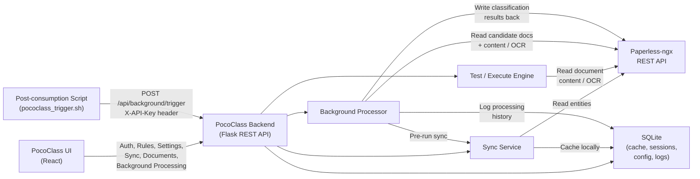

# Paperless <-> PocoClass Connectivity Overview

This document gives a focused view of how PocoClass and Paperless-ngx communicate,
how data flows between the two systems, and how processing is triggered.

## 1. High-Level Connection Diagram



## 2. Data Flow: What Goes Where

### PocoClass reads FROM Paperless
| Data | When | Purpose |
|---|---|---|
| Correspondents, Tags, Document Types | Sync (manual, pre-processing, login) | Populate dropdowns, validate rules, resolve entity names |
| Custom Fields | Sync | Check for POCO Score / POCO OCR fields, display in UI |
| Users | Sync | User management display |
| Documents (list + metadata) | Rule testing, background processing, document browsing | Match against rules, apply classification |
| Document content / OCR text | Rule testing, background processing | Pattern matching against OCR identifiers |
| Document preview (thumbnail) | UI document list | Display document thumbnails |

### PocoClass writes TO Paperless
| Data | When | Purpose |
|---|---|---|
| Tags (POCO+, POCO-) | After rule evaluation during processing | Mark documents as classified or unclassified |
| Tags (remove NEW) | After processing | Remove discovery tag from processed documents |
| Correspondent | After rule match (if rule defines one) | Assign document correspondent |
| Document Type | After rule match (if rule defines one) | Assign document type |
| Custom Fields (POCO Score, POCO OCR) | After rule evaluation | Write dual scores for transparency and audit |
| Custom Fields (static/dynamic metadata) | After rule match | Write extracted metadata (dates, amounts, etc.) |
| Document notes | After rule evaluation | Append POCO score summary to document notes |

## 3. API Endpoint Categories

### Authentication & Sessions
| Endpoint | Method | Auth | Purpose |
|---|---|---|---|
| `/api/health` | GET | None | Health check and version info |
| `/api/auth/setup` | POST | None | Initial admin setup |
| `/api/auth/complete-setup` | POST | None | Complete first-time setup |
| `/api/auth/login` | POST | None | Login with Paperless credentials |
| `/api/auth/logout` | POST | Session | End user session |
| `/api/auth/status` | GET | None | Check if setup is complete |
| `/api/auth/me` | GET | Session | Get current user info |

### Data Sync (Paperless -> PocoClass cache)
| Endpoint | Method | Auth | Purpose |
|---|---|---|---|
| `POST /api/sync` | POST | Session | Trigger full sync of Paperless entities |
| `GET /api/sync/status` | GET | Session | Check sync status |
| `GET /api/sync/history` | GET | Session | View sync history |
| `GET /api/sync/counts` | GET | Session | Get cached entity counts |

### Rule Management
| Endpoint | Method | Auth | Purpose |
|---|---|---|---|
| `GET /api/rules` | GET | Session | List all rules |
| `GET /api/rules/<rule_id>` | GET | Session | Get single rule |
| `POST /api/rules` | POST | Session | Create new rule |
| `PUT /api/rules/<rule_id>` | PUT | Session | Update rule |
| `DELETE /api/rules/<rule_id>` | DELETE | Admin | Delete rule |
| `GET /api/rules/errors` | GET | Session | Get rules with validation errors |

### Rule Testing & Execution (triggers Paperless reads)
| Endpoint | Method | Auth | Purpose |
|---|---|---|---|
| `POST /api/rules/test` | POST | Session | Test rule against document content (reads OCR from Paperless) |
| `POST /api/rules/<rule_id>/execute` | POST | Session | Execute rule against a Paperless document |

### Document Browsing (reads from Paperless via cache)
| Endpoint | Method | Auth | Purpose |
|---|---|---|---|
| `GET /api/documents` | GET | Session | List/search documents |
| `GET /api/documents/<id>/preview` | GET | Session | Get document thumbnail |
| `GET /api/documents/<id>/content` | GET | Session | Get document content / OCR text |

### Background Processing (reads + writes to Paperless)
| Endpoint | Method | Auth | Purpose |
|---|---|---|---|
| `POST /api/background/trigger` | POST | System token OR Admin session | Trigger debounced processing |
| `POST /api/background/process` | POST | Session | Manual processing with filters (Run / Dry Run) |
| `GET /api/background/status` | GET | Session | Get processing status (polled every 3s by UI) |
| `GET /api/background/history` | GET | Session | Get processing run history |
| `GET /api/background/history/<run_id>/details` | GET | Session | Get detailed results for a processing run |
| `GET /api/background/settings` | GET | Session | Get background processing settings |
| `POST /api/background/settings` | POST | Admin | Update background processing settings |

### Settings & Configuration
| Endpoint | Method | Auth | Purpose |
|---|---|---|---|
| `GET /api/settings/batch` | GET | Session | Get multiple settings at once |
| `GET /api/settings` | GET | Session | Get all settings |
| `PUT /api/settings/<key>` | PUT | Admin | Update a setting |
| `GET/POST /api/settings/app` | GET/POST | Session/Admin | App appearance settings |
| `GET /api/settings/date-formats` | GET | Session | Get available date formats |
| `PUT /api/settings/date-formats/<format>` | PUT | Admin | Toggle a date format |
| `GET/PUT /api/settings/paperless-config` | GET/PUT | Session/Admin | Paperless connection settings |
| `GET/PUT /api/settings/poco-ocr-enabled` | GET/PUT | Session/Admin | Toggle POCO OCR feature |
| `GET/PUT /api/settings/placeholders` | GET/PUT | Session/Admin | Field visibility settings |

### System Administration
| Endpoint | Method | Auth | Purpose |
|---|---|---|---|
| `GET /api/system-token` | GET | Admin | Check if system token exists |
| `POST /api/system-token` | POST | Admin | Generate new system token |
| `DELETE /api/system-token` | DELETE | Admin | Revoke system token |
| `POST /api/system/reset-app` | POST | Admin | Factory reset the application |
| `GET /api/logs` | GET | Admin | Get system logs |

## 4. Processing Pipeline

### Trigger Flow (button or script)
```
Trigger received (UI button or script)
  → Debounce timer starts (default: 30 seconds)
  → Timer fires → _execute_processing()
    → Check processing lock (prevent concurrent runs)
    → Acquire lock
    → Pre-run sync (sync_all: correspondents, tags, doc types, custom fields, users)
    → Discover documents (tagged NEW, not tagged POCO+ or POCO-)
    → For each document:
      → Fetch OCR content from Paperless
      → Test against all active rules
      → Best matching rule (highest POCO score above threshold) wins
      → If match found:
        → Write tags, correspondent, document type
        → Write POCO Score + POCO OCR custom fields
        → Write extracted metadata (static + dynamic)
        → Add POCO+ tag, remove NEW tag
        → Append score summary to document notes
      → If no match:
        → Add POCO- tag, remove NEW tag
        → Write zero scores to custom fields
    → Log results to processing history
    → Release lock
```

### Auto-Pause Mechanism
Automatic and script-triggered runs check if any user has an active session (within the last 5 minutes). If so, processing is skipped to avoid conflicting with a user actively working in the UI. UI-initiated triggers (Trigger button, Run, Dry Run) bypass this check since the user explicitly requested processing.

### Debounce Mechanism
The trigger endpoint uses a debounce timer (configurable, default 30 seconds). If multiple triggers arrive within the debounce window, only the last one executes. This prevents excessive processing when Paperless sends rapid post-consumption webhooks.

## 5. Authentication Model

| Auth Method | Used By | How It Works |
|---|---|---|
| **Session auth** (cookie) | Web UI users | Login with Paperless-ngx credentials → PocoClass validates against Paperless API → stores encrypted Paperless token in session → HttpOnly cookie |
| **System token** (X-API-Key header) | External scripts, automation | Admin generates a system token in Settings → script sends it as `X-API-Key` header → used for `/api/background/trigger` only |

All API endpoints require authentication except: `/api/health`, `/api/auth/status`, `/api/auth/login`, `/api/auth/setup`, `/api/auth/complete-setup`.

## 6. External Script Integration

The `pococlass_trigger.sh` script is designed to be called by Paperless-ngx's post-consumption hook:

```bash
# Paperless calls this after consuming a new document
# The script sends a trigger request to PocoClass
curl -X POST https://your-pococlass-url/api/background/trigger \
  -H "X-API-Key: your-system-token"
```

Because of the debounce mechanism, rapid successive calls (e.g., during bulk import) are collapsed into a single processing run after the debounce period expires.
