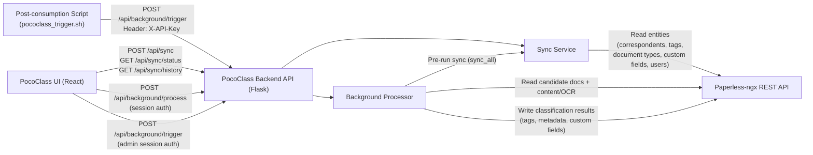

# Paperless <-> PocoClass Connections

This document gives a focused view of how PocoClass and Paperless-ngx communicate,
and how processing is triggered in automatic and manual modes.

## 1. Connection Diagram

## 2. API Call Categories

| Category | Initiator | PocoClass Endpoint(s) | Auth | Main Paperless Interaction |
|---|---|---|---|---|
| Sync data | UI / setup / login / processor pre-run | `POST /api/sync`, `GET /api/sync/status`, `GET /api/sync/history` | User session (`Authorization`/cookie) | Pull cacheable entities (correspondents, tags, document types, custom fields, users) |
| Trigger processing (automatic by script) | External script (`pococlass_trigger.sh`) | `POST /api/background/trigger` | System token (`X-API-Key`) | Processor syncs, reads target documents, applies rule output back to Paperless |
| Trigger processing (manual by user in UI) | UI user/admin | `POST /api/background/process` (manual run), `POST /api/background/trigger` (admin trigger) | Session auth | Same processing pipeline: sync, read docs, apply tags/metadata/custom fields |

## 3. Notes

- `POST /api/background/trigger` supports dual auth:
  - `X-API-Key` system token for automation/scripts.
  - Admin session for UI/admin-triggered runs.
- `POST /api/background/process` is the explicit manual-processing endpoint from the UI.
- Background processing always depends on Paperless data sync and then writes classification outcomes back to Paperless.
